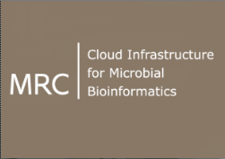

# About

The Food and Health Flagship is an RDS-funded project to provide cloud-based data services and tools
for Australian Life Science Researchers to combine, analyse and interpret
genomic, transcriptomic, proteomic and metabolomic data. The data platform will incorporate the Bioplatforms Australia Antibiotic Resistant Pathogens Initiative (ABRPI).

## Authors

 Anna Syme

 Torsten Seemann

 Simon Gladman

 Dieter Bulach

 Xin-Yi Chua

 Dominique Gorse

## Support

* [Research Data Services](http://omics.data.edu.au/)
* [Bioplatforms Australia](http://www.bioplatforms.com/antibiotic-resistant-pathogens/)
* [Nectar](http://www.nectar.org.au/)

These training materials have been used for:

**McGill Summer Institute in Infectious Diseases and Global Health, June 2016, Montreal, Canada**

**Galaxy Community Conference 2016, Indiana, USA**

**CLIMB UK Launch: Cloud Infrastructure for Microbial Bioinformatics, 2016**

