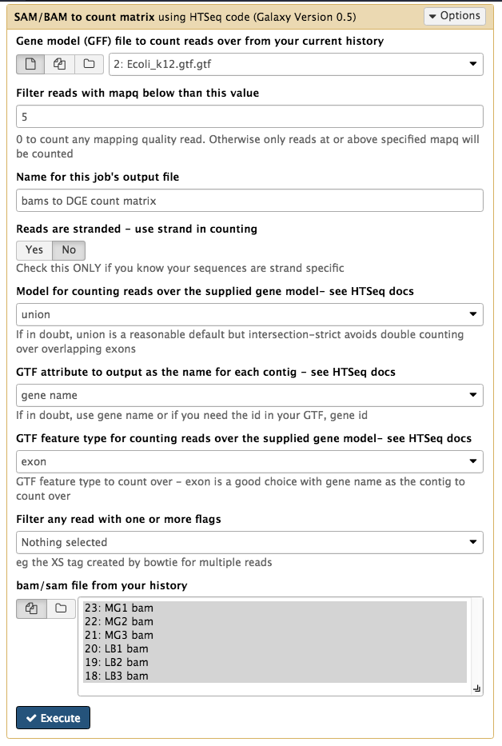
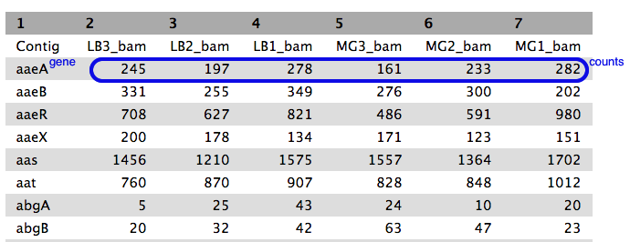

# Differential Gene Expression

This tutorial is about differential gene expression in bacteria, using Galaxy tools and Degust (web).

**FIXME:**

- Degust to be installed on mGVL Galaxy
- takes a long time with this dataset - make smaller?
- Is there any info about which is treatment and which is control? (MG vs LB) does Simon know. Have currently put MG as control and LB as treatment. More informative names and info would be good.
- get EC numbers into ref genome annotation (GTF)? so can view in Degust Kegg pathway
- Data files (Fastq reads and refs): link to swift URL? -- add correct link to the "input data" section - RNA-Seq data - and information about how to upload
- Voom output: is it sorted by t-values? What does this mean? Add sentence explaining this.

<!-- This tutorial:
- map: BWA-MEM
- count: bams to HTSeq
- DGE analysis and view: Degust (web)

Alternative tutorial:
BWA-MEM - stringtie in galaxy - combine files - ballgown in galaxy? - view?
-->

## Background
Differential Gene Expression (DGE) is the process of determining whether any genes were expressed at a different level between two conditions. For example, the conditions could be wildtype versus mutant, or two growth conditions. Usually multiple biological replicates are done for each condition - these are needed to separate variation within the condition from that between the conditions.

## Learning Objectives

At the end of this tutorial you should be able to:

1. Align RNA-Seq data to a reference genome  
2. Count transcripts for each sample
3. Perform statistical analysis to obtain a list of differentially expressed genes
4. Interpret the DGE list
5. Visualize the results

## Input data: reads and reference

We need RNA-Seq reads and a reference genome.

A typical experiment will have 2 conditions each with 3 replicates, for a total of 6 samples. Each sample will be a set of RNA sequence reads, either as one file per sample (single-end reads / SE) or two files (paired-end reads / PE).

|             | Condition 1 | Condition 2 |
|-------------|-------------|-------------|
| Replicate 1 |     1       |      4      |
| Replicate 2 |     2       |      5      |
| Replicate 3 |     3       |      6      |

Sample data set for this tutorial:

- From the bacteria *E. coli* grown in two conditions.
- Dataset contains:
    - RNA-seq reads from 6 samples in <fn>FASTQ</fn> format
    - Reference genomes in <fn>FASTA</fn> and <fn>GTF</fn> formats
- Where is it and how to upload. <!-- e.g. [RNA-Seq data](/rna/data.md) -->
- For the RNA-seq reads, change datatype to fastqsanger (not fastqCsanger)
- For the reference genome in GTF format, change datatype to GTF (not GFF)

## Align reads to reference

The RNA-Seq reads are fragmented are are not complete transcripts. To reconstruct how the reads group into transcripts (and therefore, correspond to which genes) we can map them to a reference genome.

In Galaxy:

- Go to <ss>Tools &rarr; NGS Analysis &rarr; NGS: Mapping &rarr; Map with BWA-MEM</ss>
- Under <ss>Will you select a reference genome from your history or use a built-in index?</ss>: *Use a genome from history and build index*
- <ss>Use the following dataset as the reference sequence</ss>: <fn>Ecoli fasta file </fn>
- <ss>Single or Paired-end reads</ss>: *single*
- <ss>Select FASTQ dataset</ss>:
    - Click on the multiple files icon in centre
    - Select all 6 <fn>FASTQ</fn> files (they turn blue)
    - This will map each set of transcripts to the reference genome

Your tool interface should look like this:

- Click <ss>Execute</ss>
- Click <ss>Refresh</ss> in the history pane to see if the analysis has finished.
- Output: 6 <fn>bam</fn> files of reads mapped to the reference genome.

## Count reads per gene

We now need to count how many reads overlap with particular genes. The information about gene names is from the annotated reference genome in GTF format.

In Galaxy:

- Go to <ss>Tools &rarr; NGS Analysis &rarr; NGS: RNA Analysis &rarr; SAM/BAM to count matrix</ss>     
    - note: Don't select the tool called *htseq-count*. The *SAM/BAM to count matrix* also uses that tool but allows an input of multiple bam files, which is what we want.
- For <ss>Gene model (GFF) file to count reads over from your current history</ss>, select the <fn>GTF</fn> reference genome file.
- For <ss>bam/sam file from your history</ss> choose the 6 <fn>bam</fn> files.

Your tool interface should look like this:

- Click <ss>Execute</ss>
- Click <ss>Refresh</ss> in the history pane to see if the analysis has finished.

Output:

- there is one output file: a <fn>bams to DGE count matrix</fn>.
- Click on the eye icon to see this file.

- each row is a gene (or feature) and each column is a sample, with counts against each gene.
- have a look at how the counts vary between samples, per gene.
- we can't just compare the counts directly; all need to be normalized before comparison, and this will be done as part of the DGE analysis in the next step.
- Click on the file icon underneath the file (in the history pane) to download it to your computer for use later on in this tutorial.

<!-- FIXME: need to combine each of the results in count-reads section into a single table (using galaxy table tools?) but need to munge in the annotation as well, so i or simon will need to add new tools to toolshed to do this) -->

## Test for differential gene expression

The next step is to test whether any genes have been expressed more under either condition.

Here, we will use two methods:

- voom in Galaxy
- voom in Degust

In either case, we will then examine the results in Degust (web).

[Link to Degust on github](https://github.com/Victorian-Bioinformatics-Consortium/degust#degust-formerly-known-as-dge-vis)

### DGE in Galaxy

- Input: the count matrix   
- Output: a list of DE genes

- Go to <ss>Tools &rarr; NGS Analysis &rarr; NGS: RNA Analysis &rarr; Differential Count models</ss>
    - This has options to use edgeR, DESeq, or Voom. Here we will use Voom.
- For <ss>Select an input matrix</ss> choose the <fn>count matrix</fn> file generated in the previous step.
- For <ss>Title for job outputs</ss> enter *DGE using voom*.
- For <ss>Select columns containing treatment</ss> tick boxes for the MG samples.
- For <ss>Select columns containing control</ss> tick boxes for the LB samples.
- Under <ss>Run this model using edgeR</ss> choose *Do not run edgeR*.
- Under <ss>Run the same model with DESeq2 and compare findings</ss> choose *Do not run DESeq2*.
- Under <ss>Run the same model with Voom/limma and compare findings</ss> choose *Run VOOM*.

Your tool interface should look like this:

- Click <ss>Execute</ss>.

- There are two output files.
- View the <fn>xls</fn> output file (click on the eye icon).
    - The rows are the genes; the columns are various statistics.
    - Column 2, the log fold change, is a measure of the change in expression between the control and the treatment samples.
    - Click on the file icon underneath the file (in the history pane) to download it to your computer for use later on in this tutorial.
<!--     - t values? -->

### DGE in degust

**Upload counts file**

Go to the [Degust web page](http://vicbioinformatics.com/degust/index.html). Click on <ss>Get Started</ss>.

- Click on <ss>Choose File</ss>.
- Select the <fn>htseq output file. tabular</fn> (that you previously downloaded to your computer from Galaxy) and click <ss>Open</ss>.
- Click <ss>Upload</ss>.
- A Configuation page will appear.
- For <ss>Name</ss> type *DGE in E coli*
- Click <ss>Add condition</ss>

- Add a condition called "Control" and select the MG columns.
- Add a condition called "Treament" and select the LB columns.
- <ss>Save changes</ss>
- <ss>View</ss> - this brings up the Degust viewing window.

**Run the voom analysis**

- Under <ss>Method</ss>, make sure that <ss>Voom/Limma</ss> is selected.

- Click <ss>Apply</ss>.
- This runs Voom/Limma on the uploaded counts.

## Visualize results in Degust (web)

If you have already run voom within Degust, continue from there.

Alternatively, to upload a file of DGE analysis results (e.g. from Galaxy):

- Go to the [Degust web page](http://vicbioinformatics.com/degust/index.html). Click on <ss>Get Started</ss>.
- Click on <ss>Choose File</ss>.
- Select the <fn>voom output.tabular</fn> (that you previously downloaded to your computer from Galaxy) and click <ss>Open</ss>.
- Click <ss>Upload</ss>.
- A Configuation page will appear.
- For <ss>Name</ss> type

uncheck "analyze server side"
fold change (is log FC ok?)
FDR
Ave expression
how to get condition names in here?
save
view

Things to look at:

- We want to see whether the gene expression is higher in different conditions.
Ideally, replicates within each condition should be similar.

Viewing options overview:

- Top panel at right: Configure - click to change the input settings / toggles with view
- Conditions (left hand, top): These are the diff exp conditions
- Centre - top: There are three plots (with options at the right for each)
- Under this is a heat map of gene expression
- Under this is a list of the genes (choose to sort by FDR or by the ?most highly expressed genes?  from each condition)
- Show R Code to see [stuff]

**Plots: MDS plot**
- to do
- options...

MDS is multidimensional scaling. This is a 2D plot to visualize the difference between samples.

**Plots: Expression: Parallel Coordinates**

- data has been scaled.
- Each condition has a vertical, parallel axis
- we are trying to see the relationship between conditions (axes)
- if lines between axes are parallel, = pos relationship (high A = highB)
- if lines cross between axes, = neg relationship (high A = low B)
change order of axes by dragging the name at the top of each axis. as there is no natural order (as there would be in a time series) we can try a few ways. no absolute way to find "best" order.

if you want to look at a particular section (e.g. low expression in condition A) drag the rectangle that sits on that axis to cover the area of interest. then only genes that connect to that area will be shown. to turn off, drag the top of the rectangle right down past the base of the axis.
what does it mean if lines converge at 0 on one graph - is that the point all other condtions are compared to?
good discussion of PC.  https://eagereyes.org/techniques/parallel-coordinates

- options.....

**Plots: Expression: MA plot**

- what does it stand for
- each gene is a dot on the graph
- y axis: fold.
- x axis: expression (averaged over samples -- does this mean all reps in all conditions?)
fold change vs expression.
called MA bc y M (y) is the ratio (folds) and A (x) is the avg expression
what are we looking for? high fold changes at low and high expressions?

"The MA-plot represents each gene with a dot. The x axis is the average expression over all samples, the y axis the log2 fold change of normalized counts (i.e the average of counts normalized by size factor) between treatment and control. Genes with an adjusted p value below a threshold (here 0.1, the default) are shown in red.
This plot demonstrates that only genes with a large average normalized count contain sufficient information to yield a significant call."

FC = fold change:
but note there is no single fold change of x with biological importance

- options...

**Kegg Pathway**

- in options.

A pathway is a drawn network to show interaction between molecules, including some or all of genes, proteins, RNAs, chemical reactions. E.g.
The Kegg pathway database: (Kyoto Encyclopedia of Genes and Genomes)
numbers are EC numbers - enzyme commission ->  enzyme/s that catalyze a reaction (might be >1)
Click on a pathway in the drop down menu
highlighted numbers (relate to lines in the parallel coords graph - but what is it?)

FIXME: to do:
get EC numbers in so Kegg pathway
can these be obtained from the gene IDs in the annotation?

**Heatmap**
no heading, but this is the patchwork under the plots
conditions on the left
don't know what the blocks are - one per gene?
colours: fold change - e.g. blue, lower expression, red, increased expression.

**Genes**
list of genes.

## What next?

FIXME

## More information

http://rnaseq.uoregon.edu/#exp-design-differential-gene-expression

RNA-Seq experimental design
http://vlsci.github.io/lscc_docs/tutorials/rna_seq_exp_design/rna_seq_experimental_design/

voom paper
 https://genomebiology.biomedcentral.com/articles/10.1186/gb-2014-15-2-r29

stringtie website
https://ccb.jhu.edu/software/stringtie/
