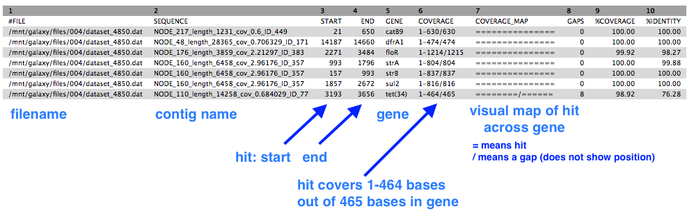

 
#Finding antibiotic-resistant genes

##Overview

- Import an assembled bacterial genome
- Find antibiotic-resistant (ABR) genes

##Import data

- Go to your Galaxy instance.
- Set up a new History for this Activity.
    - In the History panel, click on the cog icon, select <ss>Create New</ss>.
    - A new empty history should appear; click on <fn>Unnamed history</fn> and re-name it (e.g. ABR genes).

    

- Import an assembled genome (or use one from your history).
    - Copy this URL for a previously-assembled genome:  <tt>https://swift.rc.nectar.org.au:8888/v1/AUTH_377/public/Microbial_tutorials/SPAdes_contigs.fasta</tt>
    -  From the Galaxy tool panel, click on <ss>Get Data &rarr; Upload File</ss>  
    -  Click the <ss>Paste/Fetch data</ss> button  
    -  Paste the URL into the box.
    -  Click the <ss>Start</ss> button.  
    -  Once the progress bar reaches 100%, click the <ss>Close</ss> button  
    - The file will now upload to your current history.
    - Re-name it with the pencil icon to <fn>contigs.fasta</fn>.

## Find antibiotic-resistance genes

- We will use the tool called [ABRicate](https://github.com/tseemann/abricate) to find antibiotic resistance genes in the (draft) genome.
- ABRicate uses a [database](https://cge.cbs.dtu.dk/services/data.php) of these genes called [ResFinder](https://cge.cbs.dtu.dk/services/ResFinder).

In the tools panel, go to <ss>NGS Analysis: NGS Annotation: ABRicate</ss>.

- For <ss>Select fasta file</ss> choose <fn>contigs.fasta</fn> (or the name of your own assembly file.)
- Click <ss>Execute</ss>.

There is one output file. Click on the eye icon to view. It should look like this, although likely with a different number of rows.

- This shows a table with one line for each antibiotic resistance gene found, in which contig, at which position, and the % coverage.

<!-- ## Next

Column 5 has the list of ABR gene names. Some of these may be complete, exact matches, and some may have a gap/mutation in the match which can affect whether that protein is actually expressed. This can be examined in more detail by ... -->
