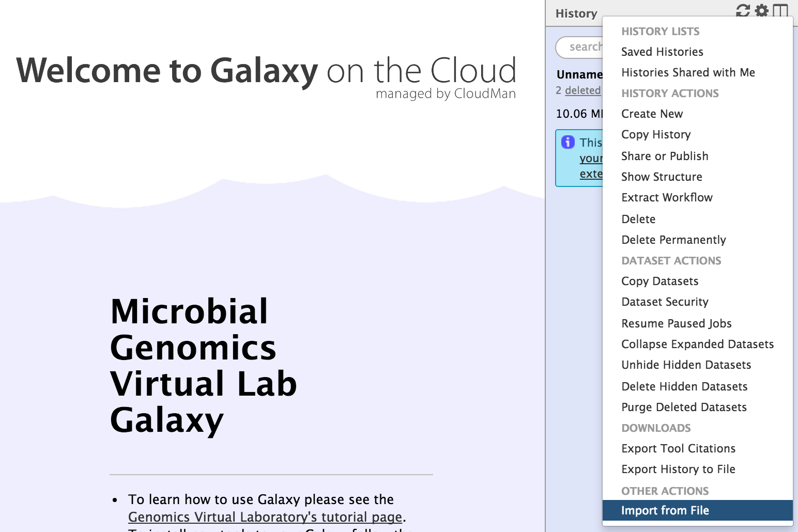

# Dataset

This page contains data for the tutorials.

## Individual input files

###Wildtype reference

* wildtype.fna

<tt> https://swift.rc.nectar.org.au:8888/v1/AUTH_377/public/Microbial_tutorials/wildtype.fna</tt>

* wildtype.gbk

<tt> https://swift.rc.nectar.org.au:8888/v1/AUTH_377/public/Microbial_tutorials/wildtype.gbk</tt>

* wildtype.gff

<tt> https://swift.rc.nectar.org.au:8888/v1/AUTH_377/public/Microbial_tutorials/wildtype.gff</tt>

### Mutant Illumina sequence

* mutant_R1.fastq.gz

<tt> https://swift.rc.nectar.org.au:8888/v1/AUTH_377/public/Microbial_tutorials/mutant_R1.fastq.gz</tt>

* mutant_R2.fastq.gz

<tt>https://swift.rc.nectar.org.au:8888/v1/AUTH_377/public/Microbial_tutorials/mutant_R2.fastq.gz</tt>

###Assembled contigs

* SPAdes_contigs.fasta

<tt>https://swift.rc.nectar.org.au:8888/v1/AUTH_377/public/Microbial_tutorials/SPAdes_contigs.fasta</tt>

### Upload to Galaxy

-  Download required file(s) to your computer.
-  From the Galaxy tool panel, click on <ss>Get Data &rarr; Upload File</ss>  
-  Click the <ss>Choose local file</ss> button  
-  Find and select the <fn>file</fn> you downloaded and click <ss>Open</ss>  
-  Set the <ss>Type</ss> correctly.  
-  Click the <ss>Start</ss> button.  
-  Once the progress bar reaches 100%, click the <ss>Close</ss> button  
- The file will now upload to your current history.

## Galaxy histories

* Galaxy history of input files

<tt>https://swift.rc.nectar.org.au:8888/v1/AUTH_377/public/Microbial_tutorials/Galaxy_history_input_files.tar.gz</tt>

* Galaxy history: FastQC

<tt>https://swift.rc.nectar.org.au:8888/v1/AUTH_377/public/Microbial_tutorials/FastQChistory.tar.gz</tt>

* Galaxy history: Spades

<tt>https://swift.rc.nectar.org.au:8888/v1/AUTH_377/public/Microbial_tutorials/Spadeshistory.tar.gz</tt>

* Galaxy history: Prokka

<tt>https://swift.rc.nectar.org.au:8888/v1/AUTH_377/public/Microbial_tutorials/Prokkahistory.tar.gz</tt>

* Galaxy history: Snippy

<tt>https://swift.rc.nectar.org.au:8888/v1/AUTH_377/public/Microbial_tutorials/Snippyhistory.tar.gz</tt>

To get the saved tutorial history (a set of files) into Galaxy:

- Copy the link address.
- Go to your Galaxy instance. Make sure you are registered and logged in. Refresh the page.
- Click on the <ss>History</ss> cog 
- Select <ss>Import from File</ss>

- In the box called <ss>Archived History URL</ss>, paste in the link address to the Galaxy history.
- Click <ss>Submit</ss>
- Wait a few seconds.
- Click on the "view all histories" button 
- See if the Galaxy history has been imported: it will be called <fn>imported from archive: Data</fn>
- Above that pane, click on the <ss>Switch to</ss> button.
- Then click <ss>Done</ss> (in the top left corner).
- You should now have a list of five files in your current history.

<!-- ## What next?

- If you are are working through the tutorials in a different order or want to see the completed history for another section, additional Galaxy histories are available above.
- Next: [Learn about quality control](../fastqc/index.md).
-->
