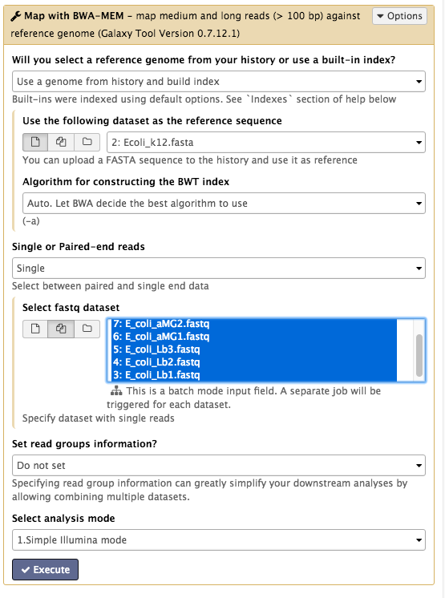
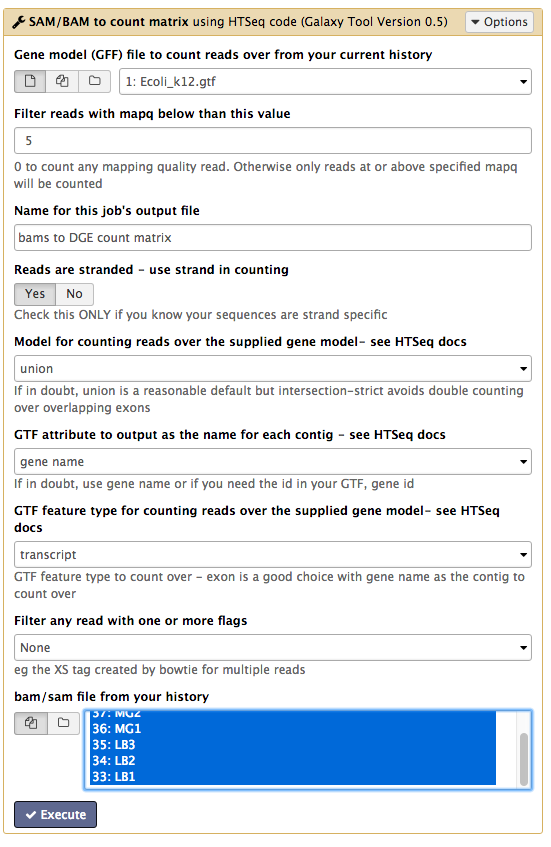
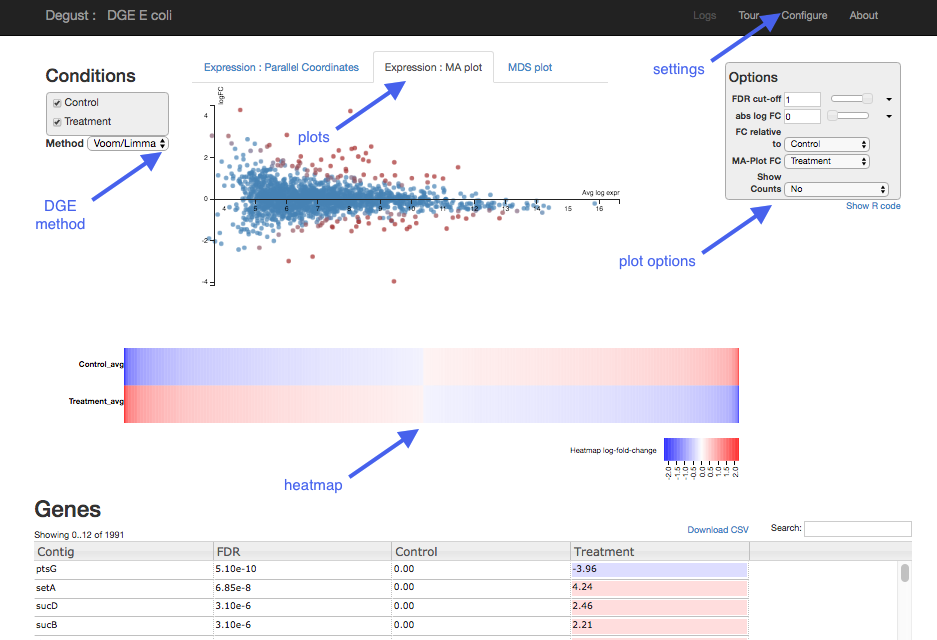
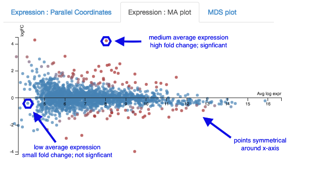

# Differential Gene Expression

This tutorial is about differential gene expression in bacteria, using Galaxy tools and Degust (web).

<!-- **FIXME:**
- Degust to be installed on mGVL Galaxy
- (Fastq files have been shortened to 1% using seqtk)
- Data files (Fastq reads and refs): link to swift URL? -- add correct link to the "input data" section - RNA-Seq data - and information about how to upload
-->

## Background
Differential Gene Expression (DGE) is the process of determining whether any genes were expressed at a different level between two conditions. For example, the conditions could be wildtype versus mutant, or two growth conditions. Usually multiple biological replicates are done for each condition - these are needed to separate variation within the condition from that between the conditions.

## Learning Objectives

At the end of this tutorial you should be able to:

1. Align RNA-Seq data to a reference genome  
2. Count transcripts for each sample
3. Perform statistical analysis to obtain a list of differentially expressed genes
4. Visualize and interpret the results

## Input data: reads and reference

**RNA-Seq reads**

A typical experiment will have 2 conditions each with 3 replicates, for a total of 6 samples.

- Our RNA-seq reads are from 6 samples in <fn>FASTQ</fn> format.
    - We have single-end reads; so one file per sample.
    - Data could also be paired-end reads, and there would be two files per sample.
- These have been reduced to 1% of their original size for this tutorial.
- The experiment used the bacteria *E. coli* grown in two conditions.
    - Files labelled "LB" are the wildtype
    - Files labelled "MG" have been exposed to 0.5% &alpha;MG - alpha methyglucoside (a sugar solution).

<!--
|             | Condition 1 | Condition 2 |
|-------------|-------------|-------------|
| Replicate 1 |     1       |      4      |
| Replicate 2 |     2       |      5      |
| Replicate 3 |     3       |      6      |

-->

**Reference genome**

The reference genomes is in <fn>FASTA</fn> format and the gene annotations are in <fn>GTF</fn> format.

- The <fn>FASTA</fn> file contains the DNA sequence(s) that make up the genome; e.g. the chromosome and any plasmids.
- The <fn>GTF</fn> file lists the coordinates (position) of each feature. Commonly-annotated features are genes, transcripts and protein-coding sequences.

<!--
- Where is it and how to upload. e.g. [RNA-Seq data](/rna/data.md)
- For the RNA-seq reads, change datatype to fastqsanger (not fastqCsanger)
- For the reference genome in GTF format, change datatype to GTF (not GFF)
-->

**Upload files to Galaxy**

- Log in to your Galaxy server.
- In the <ss>History</ss> pane, click on the cogicon, and select <ss>Import from File</ss> (at the bottom of the list).
- Under <ss>Archived History URL</ss> paste:
<tt>https://swift.rc.nectar.org.au:8888/v1/AUTH_377/public/Microbial_tutorials/Galaxy-History-BacterialDGE.tar.gz</tt>
- In the <ss>History</ss> pane, click on the viewicon and find the uploaded history.
    - (This may take a minute. Refresh the page.)
- Click <ss>Switch to</ss> that history, then <ss>Done</ss>.
- The files should now be ready to use in your current History pane.

## Align reads to reference

The RNA-Seq reads are fragmented and are not complete transcripts. To determine the transcripts from which the reads originated (and therefore, to which gene they correspond) we can map them to a reference genome.

In Galaxy:

- Go to <ss>Tools &rarr; NGS Analysis &rarr; NGS: Mapping &rarr; Map with BWA-MEM</ss>
- Under <ss>Will you select a reference genome from your history or use a built-in index?</ss>: *Use a genome from history and build index*
- <ss>Use the following dataset as the reference sequence</ss>: <fn>Ecoli_k12.fasta</fn>
- <ss>Single or Paired-end reads</ss>: *single*
- <ss>Select fastq dataset</ss>:
    - Click on the <ss>Multiple Datasets</ss> icon in centre
    - Select all 6 <fn>FASTQ</fn> files (they turn blue; use side-scroll bar to check all have been selected)
    - This will map each set of reads to the reference genome

Your tool interface should look like this:

- Click <ss>Execute</ss>
- Click <ss>Refresh</ss> in the history pane to see if the analysis has finished.
- Output: 6 <fn>bam</fn> files of reads mapped to the reference genome.

- Re-name the output files:
    - These are called <fn>Map with BWA-MEM on data x and data x</fn>.
    - Click on the pencil icon next to each of these and re-name them as their sample name (e.g. LB1, LB2 etc.).
    - Click <ss>Save</ss>.

## Count reads per gene

We now need to count how many reads overlap with particular genes. The information about gene names is from the annotations in the GTF file.

In Galaxy:

- Go to <ss>Tools &rarr; NGS Analysis &rarr; NGS: RNA Analysis &rarr; SAM/BAM to count matrix</ss>.
    - Note: Don't select the tool called *htseq-count*. The *SAM/BAM to count matrix* also uses that tool but allows an input of multiple bam files, which is what we want.
- For <ss>Gene model (GFF) file to count reads over from your current history</ss>, select the <fn>GTF</fn> file.
- For <ss>Reads are stranded</ss> select *Yes* (box turns dark grey)
- For <ss>GTF feature type for counting reads...</ss> select *transcript*.
- For <ss>bam/sam file from your history</ss> choose the 6 <fn>bam</fn> files.

Your tool interface should look like this:

- Click <ss>Execute</ss>
- Click <ss>Refresh</ss> in the history pane to see if the analysis has finished.

Output:

- There is one output file: <fn>bams to DGE count matrix</fn>.
- Click on the file name to expand the information in the History pane.
- Click on the file icon underneath to download it to your computer for use later on in this tutorial.
- Click on the eye icon to see this file.

- Each row is a gene (or feature) and each column is a sample, with counts against each gene.
- Have a look at how the counts vary between samples, per gene.
- We can't just compare the counts directly; they need to be normalized before comparison, and this will be done as part of the DGE analysis in the next step.

## DGE in Degust

Degust is a tool on the web that can analyse the counts files produced in the step above, to test for differential gene expression.

(Degust can also display the results from DGE analyses performed elsewhere.)

###Upload counts file

Go to the [Degust web page](http://vicbioinformatics.com/degust/index.html). Click <ss>Get Started</ss>.

- Click on <ss>Choose File</ss>.
- Select the <fn>htseq output file. tabular</fn> (that you previously downloaded to your computer from Galaxy) and click <ss>Open</ss>.
- Click <ss>Upload</ss>.

A Configuation page will appear.

- For <ss>Name</ss> type *DGE in E coli*
- For <ss>Info columns</ss> select *Contig*
- For <ss>Analyze server side</ss> leave box checked.
- For <ss>Min read count</ss> put *10*.
- Click <ss>Add condition</ss>
    - Add a condition called "Control" and select the LB columns.
    - Add a condition called "Treament" and select the MG columns.

Your Configuration page should look like this:

- <ss>Save changes</ss>
- <ss>View</ss> - this brings up the Degust viewing window.

###Overview of Degust sections

- Top black panel with <ss>Configure</ss> settings at right.
- Left: Conditions: Control and Treatment.
- Left: Method selection for DGE.
- Top centre: Plots, with options at right.
- When either of the expression plots are selected, a heatmap appears below.
- A table of genes (or features); expression in treatment relative to control (Treatment column); and significance (FDR column).  

###Analyze gene expression

- Under <ss>Method</ss>, make sure that <ss>Voom/Limma</ss> is selected.
- Click <ss>Apply</ss>. This runs Voom/Limma on the uploaded counts.

###MDS plot

First, look at the MDS plot.

- This is a multidimensional scaling plot which represents the variation between samples.
- Ideally:
    - All the LB samples would be close to each other
    - All the MG samples would be close to each other
    - The LB and MG groups would be far apart
- The x-axis is the dimension with the highest magnitude. The control/treatment samples should be split along this axis.
- Our LB samples are on the left and the MG samples are on the right, which means they are well separated on their major MDS dimension, which looks correct.

###Expression - MA plot
Each dot shows the change in expression in one gene.

- The average expression (over both condition and treatment samples) is represented on the x-axis.
    - Plot points should be symmetrical around the x-axis.
    - We can see that many genes are expressed at a low level, and some are highly expressed.
- The fold change is represented on the y axis.
    - If expression is significantly different between treatment and control, the dots are red. If not, they are blue. (In Degust, significant means FDR <0.05).
    - At low levels of gene expression (low values of the x axis), fold changes are less likely to be significant.

Click on the dot to see the gene name.     

###Expression - Parallel Coordinates and heatmap
Each line shows the change in expression in one gene, between control and treatment.

- Go to <ss>Options</ss> at the right.
    - For <ss>FDR cut-off</ss> set at 0.001.
    - This is a significance level (an adjusted p value). We will set it quite low in this example, to ensure we only examine key differences.
- Look at the Parallel Coordinates plot. There are two axes:
    - Left: **Control**: Gene expression in the control samples. All values are set at zero.
    - Right: **Treatment** Gene expression in the treatment samples, relative to expression in the control.

- The blocks of blue and red underneath the plot are called a heatmap.
    - Each block is a gene. Click on a block to see its line in the plot above.
    - Look at the row for the Treatment. Relative to the control, genes expressed more are red; genes expressed less are blue.

Note:

- for an experiment with multiple treatments, the various treatment axes can be dragged to rearrange. There is no natural order (such as a time series).

###Table of genes
- **Contig**: names of genes. Note that gene names are sometimes specific to a species, or they may be only named as a locus ID (a chromosomal location specified in the genome annotation).
- **FDR**: False Discovery Rate. This is an adjusted p value to show the significance of the difference in gene expression between two conditions. Click on column headings to sort. By default, this table is sorted by FDR.
- **Control** and **Treatment**: log2(Fold Change) of gene expression. The default display is of fold change in the treatment relative to the control. Therefore, values in the "Control" column are zero. This can be changed in the <ss>Options</ss> panel at the top right.
- In some cases, a large fold change will be meaningful but in others, even a small fold change can be important biologically.

Table of genes and expression:

<!--
A pathway is a drawn network to show interaction between molecules, including some or all of genes, proteins, RNAs, chemical reactions. E.g.
The Kegg pathway database: (Kyoto Encyclopedia of Genes and Genomes)
numbers are EC numbers - enzyme commission ->  enzyme/s that catalyze a reaction (might be >1)
-->

## DGE in Galaxy

Differential gene expression can also be analyzed in Galaxy. The input is the count matrix produced by a tool such as HTSeq-Count (see section above: "Count reads per gene").

- Go to <ss>Tools &rarr; NGS Analysis &rarr; NGS: RNA Analysis &rarr; Differential Count models</ss>
    - This has options to use edgeR, DESeq, or Voom. Here we will use Voom.
- For <ss>Select an input matrix</ss> choose the <fn>count matrix</fn> file generated in the previous step.
- For <ss>Title for job outputs</ss> enter *DGE using voom*.
- For <ss>Select columns containing treatment</ss> tick boxes for the MG samples.
- For <ss>Select columns containing control</ss> tick boxes for the LB samples.
- Under <ss>Run this model using edgeR</ss> choose *Do not run edgeR*.
- Under <ss>Run the same model with DESeq2 and compare findings</ss> choose *Do not run DESeq2*.
- Under <ss>Run the same model with Voom/limma and compare findings</ss> choose *Run VOOM*.

Your tool interface should look like this:

- Click <ss>Execute</ss>.

There are two output files.

View the file called <fn>DGEusingvoom.html</fn>.

- Scroll down to "VOOM log output" and "#VOOM top 50".
- The "Contig" column has the gene names.
- Look at the "adj.P.Val" column. This is an adjusted p value to show the significance of the gene expression difference, accounting for the effect of multiple testing. Also known as False Discovery Rate. The table is ordered by the values in this column.
- Look at the "logFC" column. This is log2(Fold Change) of relative gene expression between the treatment samples and the control samples.

View the file called <fn>DEGusingvoom_topTable_VOOM.xls</fn>.

- This is a list of all the genes that had transcripts mapped, and associated statistics.

##What next?

To learn more about the differentially-expressed genes:

- Go to [the NCBI website.](http://www.ncbi.nlm.nih.gov)
- Under <ss>All Databases</ss>, click on *Gene*
- Enter the gene name in the search bar; e.g. ptsG
- Click on the first result that matches the species (e.g. in this case, *E. coli*).
    - This provides information about the gene, and may also show further references (e.g. in this case, a link to the EcoGene resource).

Some of the most (statistically) significant differentially-expressed genes in this experiment are:

- [ptsG](http://www.ncbi.nlm.nih.gov/gene/945651): a glucose-specific transporter.
- [setA](http://www.ncbi.nlm.nih.gov/gene/944793): a sugar efflux transporter; is induced by glucose-phosphate stress.
- [sucD](http://www.ncbi.nlm.nih.gov/gene/945314): the alpha subunit of the the gene for succinyl-CoA synthetase; involved in ATP production.
- [sucB](http://www.ncbi.nlm.nih.gov/gene/945307): a component of the 2-oxoglutarate dehydrogenase complex; catalyzes a step in the Krebs cycle.
- [deoC](http://www.ncbi.nlm.nih.gov/gene/948902): 2-deoxyribose-5-phosphate aldolase; binds selenium; may be involved in selenium transport.

Next steps: Investigate the biochemical pathways involving the genes of interest.

## More information

- [Link to Degust.](https://github.com/Victorian-Bioinformatics-Consortium/degust#degust-formerly-known-as-dge-vis)
- [Link to Voom paper.]( https://genomebiology.biomedcentral.com/articles/10.1186/gb-2014-15-2-r29)

<!-- If you have already run voom within Degust, continue from there. -->

<!---
Not sure if this is right: can't see MDS plot?

Alternatively, to upload a file of DGE analysis results (e.g. from Galaxy):

- Go to the [Degust web page](http://vicbioinformatics.com/degust/index.html). Click on <ss>Get Started</ss>.
- Click on <ss>Choose File</ss>.
- Select the <fn>voom output.tabular</fn> (that you previously downloaded to your computer from Galaxy) and click <ss>Open</ss>.
- Click <ss>Upload</ss>.
- A Configuation page will appear.
- For <ss>Name</ss>, give it a name.
- Leave other setting as they are except:
- For <ss>Analyze server side</ss> uncheck box.
- For <ss>Primary condition</ss> write "Control".
- For <ss>FDR column</ss> click on the drop-down list and choose *adj.P.Val*
- For <ss>Average expression column</ss> click on the drop-down list and choose *AveExpr*.
- For <ss>Fold-change columns</ss> check the box next to *logFC*.
    - this is the change in the treatment relative to the control (FIXME: check)
- Click <ss>Save changes</ss>.
- Click <ss>View</ss>.
--->
