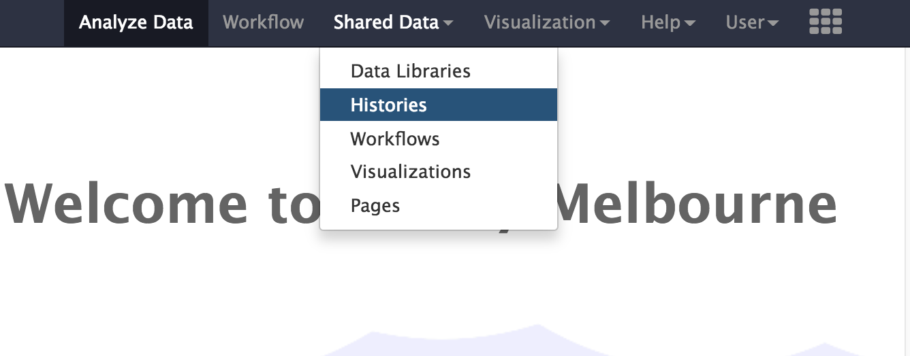
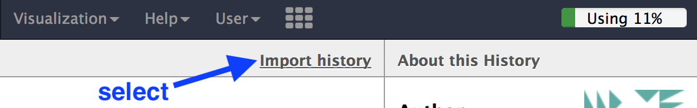
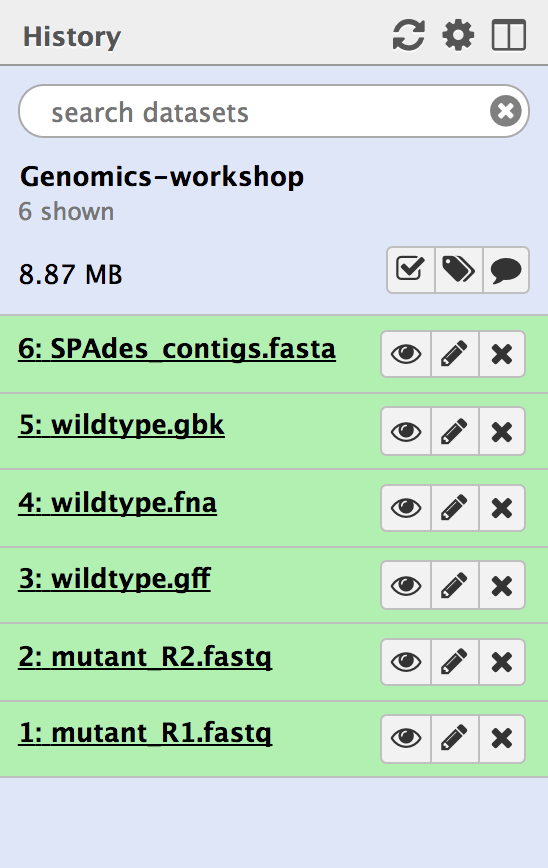
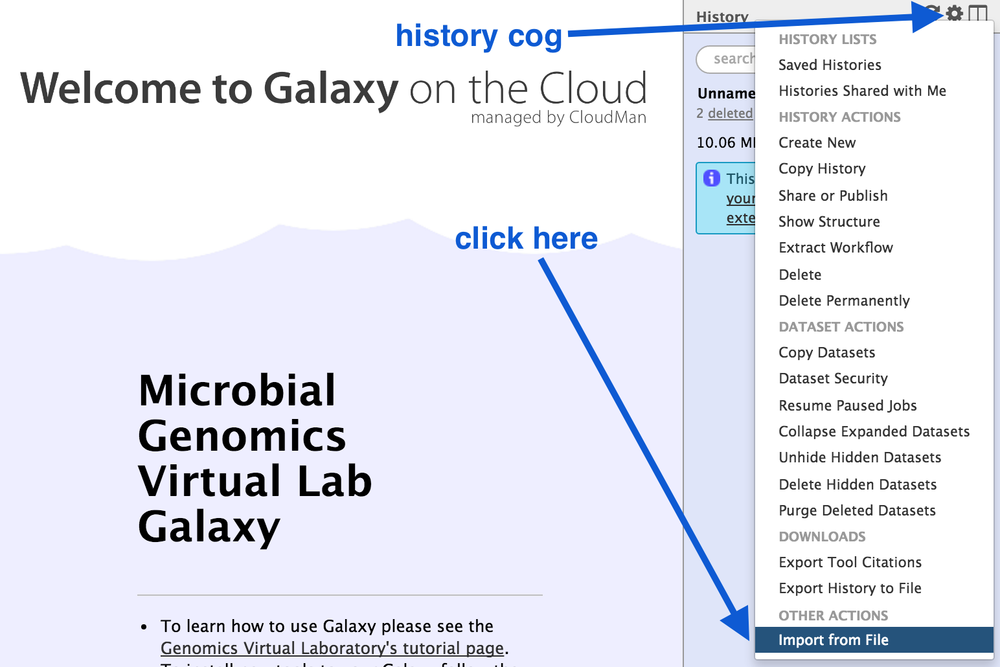

 
# Starting with Galaxy

Keywords: Galaxy, Microbial Genomics Virtual Lab

## Background

Galaxy is a web-based analysis and workflow platform designed for biologists to analyse their own data. It can be used to run a variety of bioinformatics tools. The selection of bioinformatics tools installed on the Galaxy instance we are using today caters for the analysis of bacterial genomics data sets.

Galaxy is an open, web-based platform. Details about the project can be found [here](https://galaxyproject.org/).

The Galaxy interface is separated into three parts. The <ss>Tools</ss> list on the left, the <ss>Viewing</ss> panel in the middle and the analysis and data <ss>History</ss> on the right.

## Register

* Use Firefox, Chrome or Safari as your browser (not Internet Explorer).
* Open a new tab. 
* In the address bar, type in the address of your galaxy server.
    * e.g. <http://galaxy-mel.genome.edu.au/galaxy> or <https://galaxy-qld.genome.edu.au/galaxy>

Click on <ss>User</ss> button on the right.

- Select: <ss>User &rarr; Register</ss>
- Enter your email, choose a password, and choose a user name.
- Click <ss>Submit</ss>

- Login, and refresh the page.

## Import a shared history

For Galaxy-mel/Galaxy-qld users, import the following history: 

* In Galaxy, go to the top menu bar
* Click on <ss>Shared Data</ss> 

* From the drop down menu, click on <ss>Histories</ss>

* From the list of Published Histories, click <fn>Genomics-workshop</ss> 

* In the top right, click on <ss>Import history</ss>

* This history will now be in your "Current history" - the right hand pane in Galaxy. 
* There should be six files. (The number in front of the file name is not important.)

* We will use this files for the Genomics Workshop. For additional ways to import histories, see below. 

## Alternatively: Import a history

<!-- - In the menu options across the top, go to <ss>Shared Data</ss>.
- Click on <ss>Histories</ss>.

- A list of published histories should appear. Click on the history that you want to use.

<!--For the Genomics Workshop, click on this one:

- A useful starting history is a set of files containing sequencing reads and reference genomes.
- Click on **Genomics-files**.

- Then click on <ss>Import history</ss>.
- An option will appear to re-name the history. We don't need to rename it, so click <ss>Import</ss>.
- The history will now appear in your Current History pane, and the files are ready to use in Galaxy analyses.

- *Note: if this history is not available in your version of Galaxy, please see the [following page](../data-dna/index.md) for links and information about uploading data.*
-->

Copy this link:

<tt>https://swift.rc.nectar.org.au:8888/v1/AUTH_377/public/Microbial_tutorials/Galaxy_history_input_files.tar.gz</tt>

- Click on the <ss>History</ss> cog 
- Select <ss>Import from File</ss>

- In the box called <ss>Archived History URL</ss>, paste in the link address to the Galaxy history (that you copied above).
- Click <ss>Submit</ss>
- Wait a few seconds.
- Click on the <ss>view all histories</ss> button 
- See if the Galaxy history has been imported: it will be called <fn>imported from archive: Data</fn>
- Above that pane, click on the <ss>Switch to</ss> button.
- Then click <ss>Done</ss> (in the top left corner).
- You should now have a list of five files in your current history. We will use these for the Genomics Workshop; or see below for additional files.

## Other ways to import data into Galaxy

- Upload a file from your computer
- Import a shared history
- See the [next section](../data-dna/index.md) for more detailed information.
