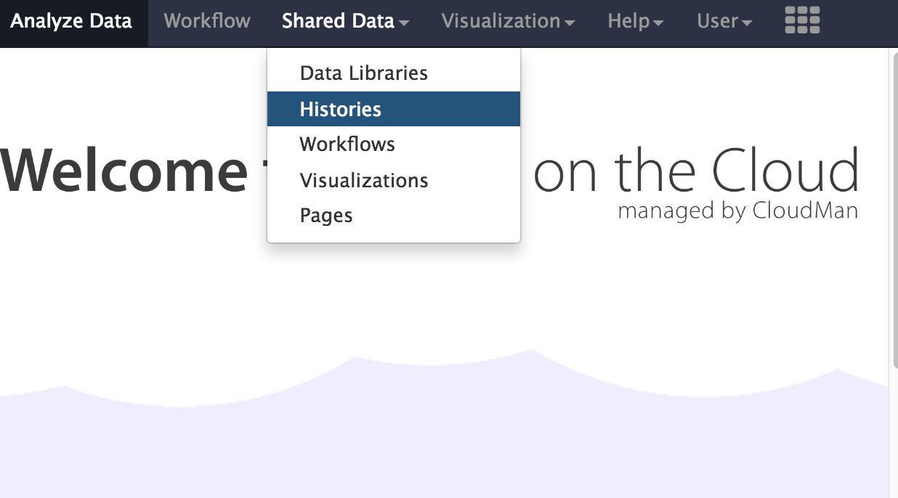

# Get Data into Galaxy

## Galaxy Background

Galaxy is a web-based analysis and workflow platform designed for biologists to analyse their own data. It can be used to run a variety of bioinformatics tools. The selection of bioinformatics tools installed on the Galaxy instance we are using today caters for the analysis of bacterial genomics data sets.

Galaxy is an open, web-based platform. Details about the project can be found [here](https://galaxyproject.org/).

The Galaxy interface is separated into three parts. The <ss>Tools</ss> list on the left, the <ss>Viewing</ss> panel in the middle and the analysis and data <ss>History</ss> on the right.

## Register in Galaxy

Open a new tab or window on your web browser. Use Firefox or Chrome - please don’t use Internet Explorer or Safari.

In the address bar, type in the address of your galaxy server. Alternatively, you can access galaxy via the dashboard of your mGVL.

Click on <ss>User</ss> button on the right.

- Select: <ss>User &rarr; Register</ss>
- Enter your email, choose a password, and choose a user name.
- Click <ss>Submit</ss>

## Import a history

- In the menu options across the top, go to <ss>Shared Data</ss>.
- Click on <ss>Histories</ss>.

- A list of published histories should appear. Click on <fn>GCC 2016 small genome assembly</fn>.
- Click on <ss>Import history</ss>.
- An option will appear to re-name the history. We don't need to rename it, so click <ss>Import</ss>.

- The history will now appear in your Current History pane, and the files are ready to use in Galaxy analyses.
