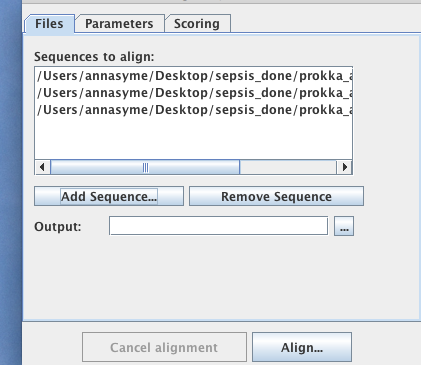
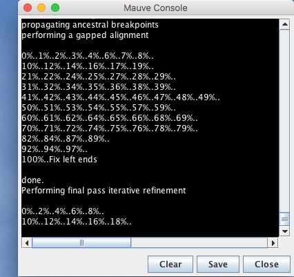
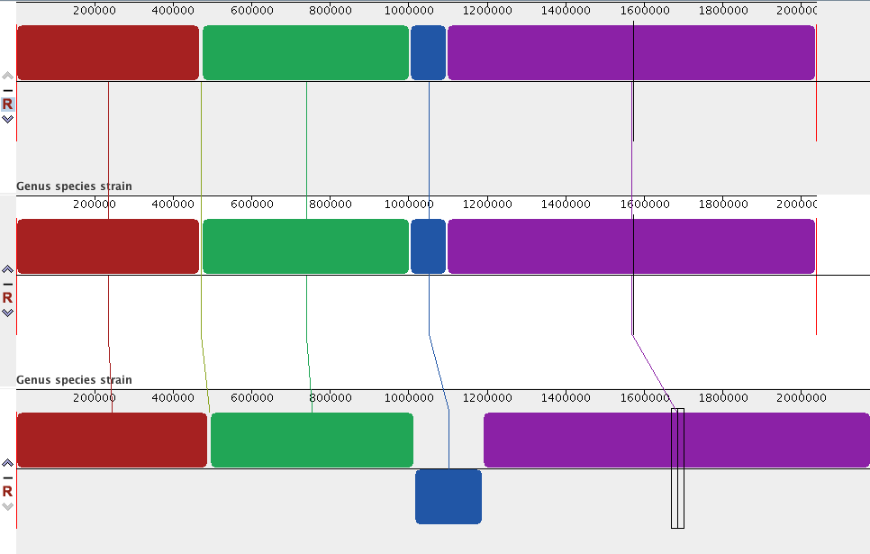

# Mauve

Mauve is a program to align multiple genomes.

Documentation: <http://darlinglab.org/mauve/mauve.html>

What it does:

- aligns genomes and identifies homologous blocks
- these are likely from a common ancestor or gained via horizontal transfer
- blocks may have moved or been inverted in the genome

## Mauve - align three strains

We will align three genomes of *Streptococcus pneumoniae*.
<!--from sepsis-done - post prokka annotations
SP18015
SP1802
SP4496
.gbk
-->

Open Mauve.

- Go to <ss>File</ss>: <ss>Align with Progressive Mauve</ss>

- <ss>Add Sequence</ss>

  - select the sequence(s). Use .fasta or .gbk files.
  - if using a reference sequence, add that first.

- <ss>Align</ss>

- Specify a name for the alignment.  

- <ss>Save</ss>

A console window will open and show the progress of the run.

When finished, the alignment will open:

- Each row is a genome. Each coloured block is genetically similar.
- If you are using annotated genomes, zoom in (with the magnifying glass) to see annotations. 

For a different view, go to <ss>View: Style: Solid LCB colouring</ss>

- Click on a block to align all genomes around that block.
- The blue block is inverted in genome 3 (i.e., the reverse complement).

## Mauve - align two assemblies from the same sample

In this example, we will align two genomes from the same sample that have been assembled with different tools.

- Genome 1: Assembled from long reads; corrected with short reads.
- Genome 2: Assembled from short reads.

Align the genomes:

- Go to <ss>File</ss>: <ss>Align with Progressive Mauve</ss>
- Add sequences. Add the long-read assembly sequence first.
- <ss>Align</ss>
- Name
- <ss>Save</ss>

View the alignment:

Genome 2 has many contigs as it has been assembled using short reads.

- These have been laid out in the order in which they appear in the file.
- We need to re-arrange these contigs to align with the reference genome (Genome 1).

Re-order the contigs in Genome 2:

- Go to <ss>Tools</ss>: <ss>Move Contigs</ss>
- Specify output folder
- Add sequences (add the long-read assembly first)
- <ss>Start</ss>

The Mauve Console window will show the progress.

The re-ordered contigs will then be displayed:

Most of the contigs in Genome 2 can be aligned to one (red) section of Genome 1.
