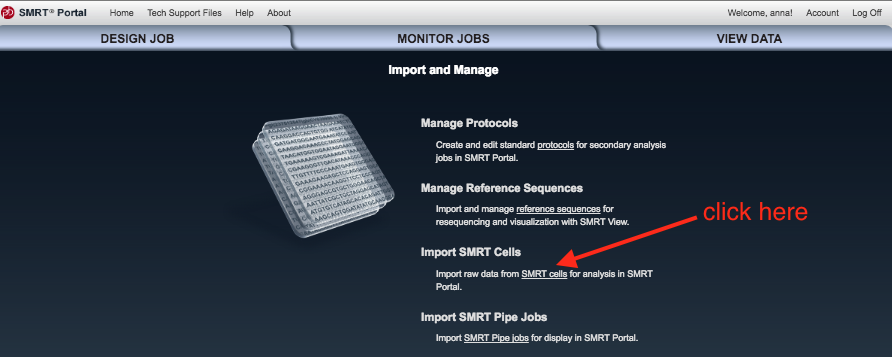
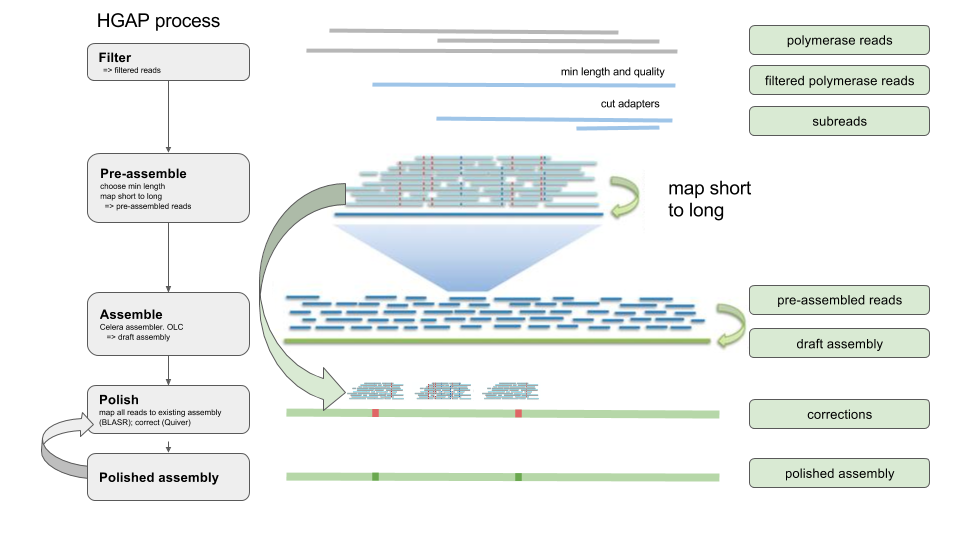
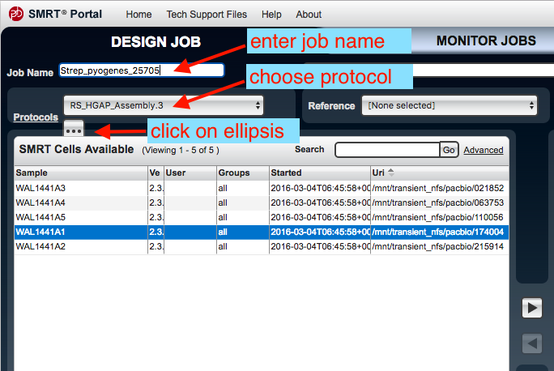
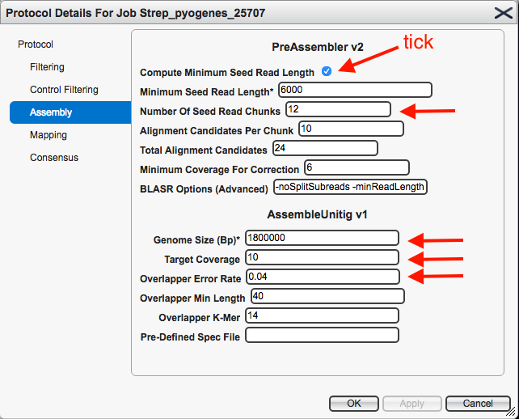
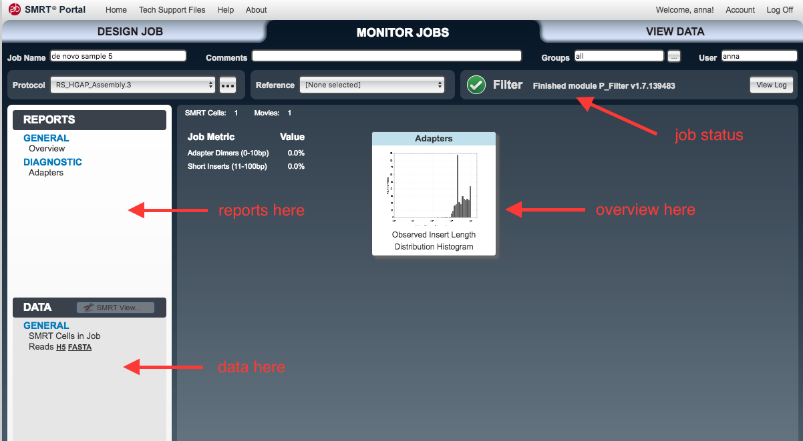

 
#Assembly with PacBio data and SMRT Portal

Keywords: de novo assembly, PacBio, PacificBiosciences, HGAP, SMRT Portal, Microbial Genomics Virtual Laboratory

This tutorial will show you how to assemble a bacterial genome *de novo*, using the PacBio SMRT Portal on the mGVL. We will use an analysis pipeline called HGAP, the Hierarchical Genome Assembly Process.

<!-- FIXMEs:

- will SMRT portal be available on all training GVLs
- will students use existing SMRT portal registrations, or will each set up their own
- PacBio data training data to be loaded into SMRT portal(s) -->

## Start
- Open your mGVL dashboard.
- You should see SMRT Portal as one of the instance services on your GVL dashboard.
- Open up the SMRT portal web link (to the right) and register/log on.

## Input
<!-- We will use a publicly available data-set of PacBio reads from the bacteria *E. coli* (reference link below).
-->

We will use a dataset from a *Streptococcus pyogenes* bacteria.

If this has already been loaded onto SMRT portal (e.g. for use during a workshop), proceed to the next step ("Assembly").

Otherwise:

- Load the PacBio data (your own, or the training dataset) onto your GVL.
- In the SMRT Portal, go to <ss>Design Job</ss>, the top left tab.
- Go to <ss>Import and Manage</ss>.

- Click <ss>Import SMRT cells</ss>.

- Work out where you put the data on your GVL, and make sure the file path is showing.
    - If not, click <ss>Add</ss> and enter the file path to the data.
- Click on the file path and then <ss>Scan</ss> to check for new data.

## Assembly

###HGAP process overview

We will use the Hierarchical Genome Assembly Process (HGAP). This flowchart shows the steps in the process:

###Set up job

- In the SMRT Portal, go to the top left tab, <ss>Design Job</ss>.
- Go to <ss>Create New</ss>.
- An <ss>Analysis</ss> window should appear. Check the box next to <ss>De novo assembly</ss>, then <ss>Next</ss>.
- Under <ss>Job Name</ss> enter a name.
- Under <ss>Protocols</ss> choose <ss>RS_HGAP_Assembly.3</ss>.
- There is an ellipsis underneath <ss>Protocols</ss> - click on the ellipsis.

This brings up the settings. Click on <ss>Assembly</ss>.

- For <ss>Compute Minimum Seed Read Length</ss>: ensure box is ticked
- For <ss>Number of Seed Read Chunks</ss>: enter *12*
- Change the <ss>Genome Size</ss> to an approximately correct size for the species. For *S. pyogenes*, enter 1800000.
- For <ss>Target Coverage</ss>: enter *10*
- For <ss>Overlapper Error Rate</ss>: enter *0.04*
- Leave all other settings as they are.
- Click <ss>Apply</ss>

 Your protocol window should look like this:

- Click <ss>Ok</ss>.  

- In the <ss>SMRT Cells Available</ss> window, select the file to be used. Click on the arrow to transfer these files to the SMRT Cells in Job window.

- Click <ss>Save</ss> (bottom right hand side).
- Next to <ss>Save</ss>, click <ss>Start</ss>.
- The <ss>Monitor Jobs</ss> window should open.
    - As each step proceeds, new items will appear under the <ss>Reports</ss> and <ss>Data</ss> tabs on the left.

###Inputs and Outputs

The connections between the names of assembly stages and outputs is not always clear. This flowchart shows how each stage of the HGAP process corresponds to protocol window names and outputs:

## Results

If the job is still running, click on the centre tab <ss>Monitor Jobs</ss>. Otherwise, click on the top right tab, <ss>View Data</ss>.

- Double click on the job name to open its reports.
- Click on different <ss>Reports</ss> in the left hand panel.

Things to look at:

**General: Filtering (polymerase reads)**

- number of reads post-filter
- read length (=average)

**General: Subread Filtering (subreads)**

- number of reads post-filter
- read length (average)

**Assembly: Pre-Assembly (pre-assembled reads)**

- length cutoff (the computed minimum seed read length)
- read length (average)

**Assembly: Corrections**

Consensus calling results:

- Consensus concordance should be > 99%.

Graph: corrections across reference:

- With the first run of polishing, we expect a lot of corrections but they should be randomly distributed.

**Assembly: Top Corrections**

This is a list of all the corrections made.

- If more than two corrections (with confidence > 50), repeat polishing (see next section "Further polishing").

**Resequencing: Coverage**

Coverage across reference:

- discard contigs <20X coverage
- others should have fairly consistent coverage.
- spikes could be collapsed repeats.
- valleys could be mis-assembly - e.g. draft assembly was incorrect and so remapped reads didn't support this part of the assembly.

Graph: Depth of Coverage:

*Number* of reference regions vs coverage. <!-- Should be roughly normal? -->

**Assembly: Polished Assembly**

- number of contigs
- max contig length
- graph: confidence vs depth. multi-copy plasmids may have higher coverage.

## Further Polishing

During polishing, raw reads are used to correct the assembly.
During HGAP, the assembly was polished once but may need further corrections.

- From the previous step, Go to <ss>Data &rarr; Assembly &rarr; Polished Assembly</ss> and download the FASTA file by clicking on it.
    - Unzip the .gz file
- Go to <ss>Design Job &rarr; Import and Manage</ss> and click <ss>New</ss> on the bottom right hand side. Then, select that FASTA assembly file to upload.
    - creates a new reference.
- Go to <ss>Design Job &rarr; Create New</ss>
    - choose reference-based
    - Select protocol: RS_Resequencing.1
    - Leave all settings.
    - Select your reference from the drop down menu.
    - Click <ss>Save</ss> and <ss>Start</ss>.
- Examine the output assembly and repeat if necessary (e.g. if > 2 corrections with >50 confidence).

##Output

The polished assembly as a FASTA file.

- download to local computer; or
- open file in (GVL) Galaxy; or
- open file in GVL command line: and perform further analysis.

##Next
Further options:

- correct with Illumina reads
- circularise
- annotate

## Links to more information

[PacBio *E. coli* data set](https://github.com/PacificBiosciences/DevNet/wiki/E.-coli-Bacterial-Assembly)

[HGAP overview](https://github.com/PacificBiosciences/Bioinformatics-Training/wiki/HGAP)

[A full ist of reports and terminology](http://files.pacb.com/software/smrtanalysis/2.3.0/doc/smrtportal/help/Webhelp/SMRT_Portal.htm)

[Video overview of HGAP on SMRT portal](http://www.pacb.com/training/BacterialAssemblyandEpigeneticAnalysis/story.html)

[More about the SMRT bell template](http://files.pacb.com/Training/IntroductiontoSMRTbellTemplatePreparation/story_content/external_files/Introduction%20to%20SMRTbell%E2%84%A2%20Template%20Preparation.pdf)
