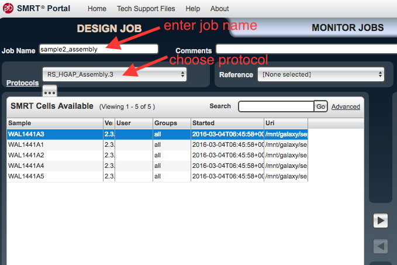
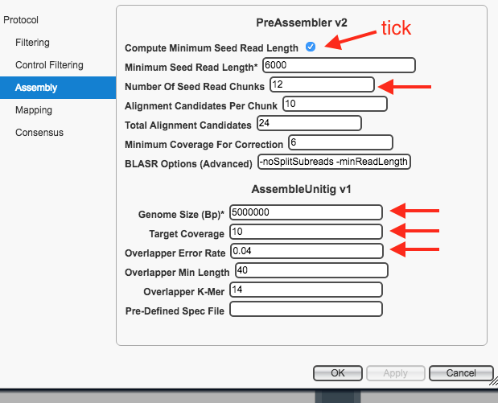

#Assembly with PacBio data and SMRT Portal

<!-- *FIXME to do*

- where is some pac bio data - should be on its way soon - email from mabel.
- to get into SMRT portal: need to download onto particular GVL
- is format ok or do we need certain files- and how many cells per sample ?

-->

This tutorial will show you how to assemble a bacterial genome *de novo*, using the PacBio SMRT Portal on the mGVL. We will use an analysis pipeline called HGAP, the Hierarchical Genome Assembly Process.

## Start
- Open your mGVL dashboard.
- Go to Admin. There is a list of packages. Find SMRT Analysis. On the right, click <ss>Install</ss>.
- You should see SMRT Portal as one of the instance services on your GVL dashboard.
- Open up the SMRT portal web link (to the right) and register/log on.

<!--
Not included here?
- trim overhang
- circularise
- annotate
-->

## Input

- Locate your PacBio data.
- Load the PacBio data onto your GVL.
- In the SMRT Portal, go to <ss>Design Job</ss>, the top left tab.
- Go to <ss>Import and Manage</ss>.

- Click <ss>Import SMRT cells</ss>.

- Work out where you put the data on your GVL, and make sure the file path is showing.
    - If not, click <ss>Add</ss> and enter the file path to the data.
- Click on the file path and then <ss>Scan</ss> to check for new data.

## Assembly

- Go back to the top left tab, <ss>Design Job</ss>.
- Go to <ss>Create New</ss>.
- An <ss>Analysis</ss> window should appear. Check the box next to <ss>De novo assembly</ss>, then <ss>Next</ss>.
- Under <ss>Job Name</ss> enter a name.
- Under <ss>Protocols</ss> choose <ss>RS_HGAP_Assembly.3</ss>.
- There is an ellipsis underneath <ss>Protocols</ss> - click on the ellipsis.

This brings up the settings. Click on <ss>Assembly</ss>.

- For <ss>Compute Minimum Seed Read Length</ss>: ensure box is ticked
- For <ss>Number of Seed Read Chunks</ss>: enter *12*
- Change the <ss>Genome Size</ss> to an approximately correct size for the species.
- For <ss>Target Coverage</ss>: enter *10*
- For <ss>Overlapper Error Rate</ss>: enter *0.04*
- Leave all other settings as they are.
- Click <ss>Apply</ss>

 Your protocol window should look like this:

- Click <ss>Ok</ss>.  

- In the <ss>SMRT Cells Available</ss> window, select the file to be used. Click on the arrow to transfer these files to the SMRT Cells in Job window.

- Click <ss>Save</ss> (bottom right hand side).
- Next to <ss>Save</ss>, click <ss>Start</ss>.
- The <ss>Monitor Jobs</ss> window should open.
    - As each step proceeds, new items will appear under the <ss>Reports</ss> and <ss>Data</ss> tabs on the left.

## Output

- Click on the top right tab, <ss>View Data</ss>. Double click on the job name to open its reports.
- Click on different reports in the left hand panel.
- Look at <ss>Assembly: Polished Assembly</ss>.
- If there is only one contig, then this is the assembled genome. We will do further polishing in the next step.
- If there are two or more contigs, one could be a plasmid, or the sample may require different assembly parameters, or new sequencing.

##Polishing

During polishing, raw reads are used to correct the assembly.

- From the previous step, Go to Data: Assembly: Polished Assembly: and download the FASTA file by clicking on it.
- Unzip the .gz file
- Go to Design Job, Import and Manage, (bottom right hand side button:) New, then select that FASTA assembly file to upload.
    - creates a new reference.
- <ss>Design Job &rarr; Create New</ss>
- choose reference-based
- Select protocol: RS_Resequencing.1
- Leave all settings.
- Select SMRT cell (same cell as used in the first analysis)
- Select your reference from the drop down menu.
- Save.
- Start.
- When complete, see Reports.
    - Variants: how many found? if less than 2, does not need any more polishing.
    - If 2+ variants found, repeat the polishing step (including adding a new reference).

## Next
Correct with Illumina reads <link to tutorial>

## Links to more information
- [HGAP overview](https://github.com/PacificBiosciences/Bioinformatics-Training/wiki/HGAP)
- [A full ist of reports and terminology is here](http://files.pacb.com/software/smrtanalysis/2.3.0/doc/smrtportal/help/Webhelp/SMRT_Portal.htm)
