 
# Pathway prediction and annotations for new organisms

## Connect to mGVL using VNC

* Go to the mGVL dashboard
* Click on the link next to the __Lubuntu Destkop__ (http://your-mgvl-ip-address/vnc)

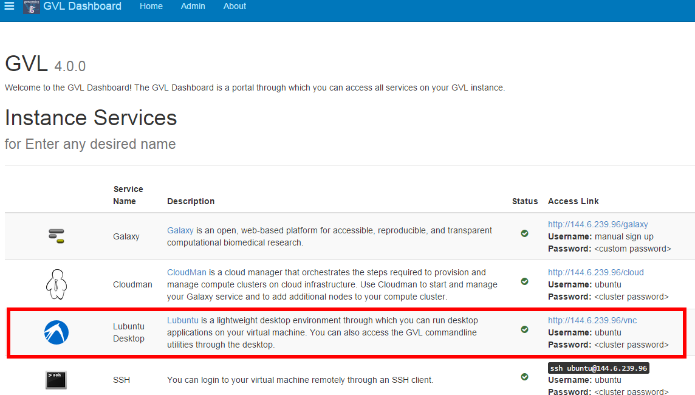

A new browser will appear, enter your user credentials to login

## Create a new Database

Once logged in, you should see the following desktop with the 3 Pathway tools icons on the left. Click on the first
icon __Pathway Tools v1.9.5__. This will bring up a new window.

* In the __Pathway Tools__ window, click on <ss>Tools</ss> menu item and then click on <ss>PathLogic</ss>
* In the new window, at the top, click on <ss>Database</ss> and then <ss>Create New</ss>

Provide the metadata for the new database. In the __Database(required)__ section, enter the following values:

* __Organism/Project ID:__ <ss>SEPSIS25707</ss>
* __Database Name:__ <ss>SepsisCycl</ss>

Leave the other parameters as the default values, that is:
*	Version: 1.0 (default)
*	DB Storage Type: File (default)

Under the __Taxonomy (required)__ section:

* Check Box if this is a multi-organism database: <ss>uncheck</ss>
*	In __Organism taxonomic class__, type "1314" and click on <ss>Select</ss>. The species name of Streptococcus pyogenes will appear and a popup window will also appear. Click on to close the window.
*	Create organism?: click <ss>yes</ss>
*	Strain: <ss>HKU419(ARP)</ss> for sample (25707)
*	Genome Source: <ss>ARP</ss>
* NCBI taxonomy ID: <ss>1314</ss> (come back to this after Select "Strain" in next step)
* Rank : Select <ss>Strain</ss>

Leave all other fields as their default values:

* Full Species Name: autocomplete from the previous step
*	Abbreviated Species Name: auto complete from the previous step
*	Subspecies : leave it blank
* Default Codon Table: 11 - Bacterial and Plant Plastid...
* Mitochondrial Codon Table : 0 - Unspecified

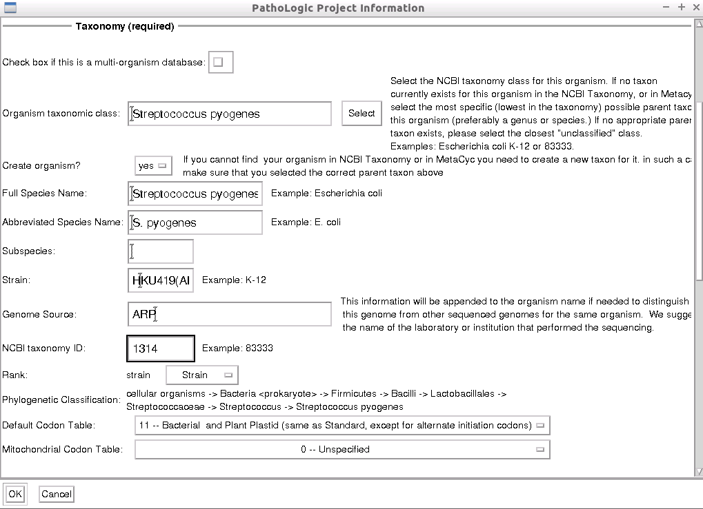

Leave __Credits(optional)__ section black.

* Click <ss>OK</ss>.

Another window will appear while processing. Wait for processing to complete, until you see the next window. Click on <ss>Enter Replicon Editor</ss>.

### Specify Replicon details

In this view, you provide the details of the annotated assembly. Each chromosome will have a separate entry. For each chromosome, you need to provide the __GBK__ and __FNA__ annotation files from Prokka.

*	Name : <ss>1</ss> ( This is the chromosome name or number)
*	Circular: <ss>checked</ss> if circulator was performed or leave it unchecked
*	Select annotation file: select the gbk from prokka
*	Select sequence file: select the fna from prokka

Leave other fields as their default value:

* Type: Chromosome (default)
*	Code: Bacterial, Archaeal and Plant Plastid (default)
*	ID: leave it blank (default)
*	Links to other database: NCBI Reference Sequences Database (default)
*	Relationship : same Entity (default)

*	Click <ss>OK</ss>

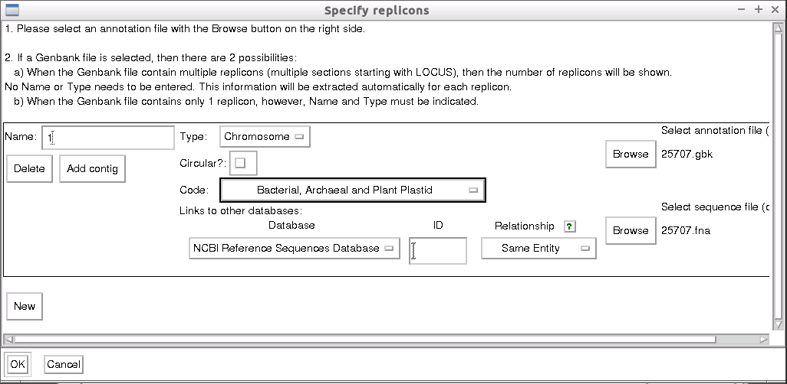

The metada for this database has now been created. Next we need to predict the pathways and annotate them.

## Predict and annotate the pathways

Still on the previous window, from the top menu bar, click on <ss>Build</ss> and then <ss>Automated Build</ss>. This will take a while depending on the number of replicons that was included for this database.

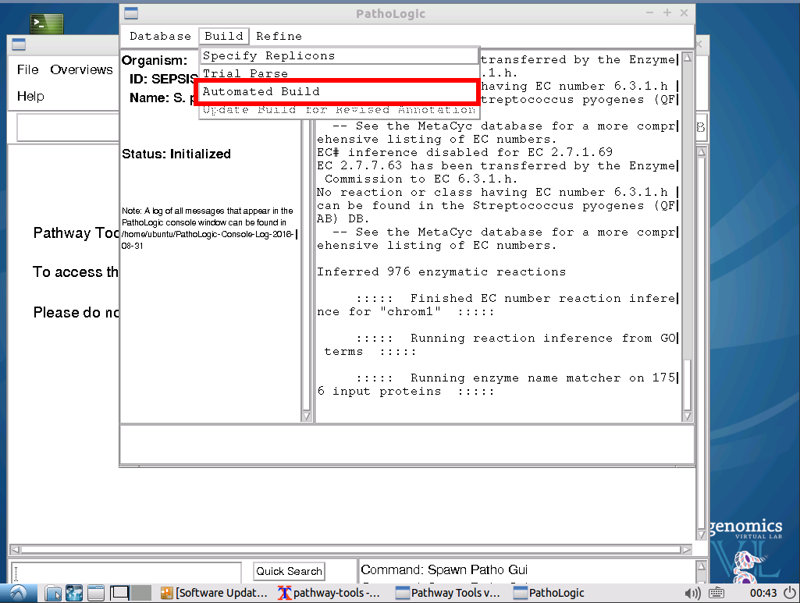

Once the process has completed, a new window, __Pathway Scoring Parameters__ will appear. Leave the values as their default values.

* Taxonomic Pruning: Enabled (default)
* Pathway Prediction Score Cutoff: 0.15 (default).

A higher cutoff value for the _prediction score_ will mean less pathways are predicted. This is the level of stringency imposed on the prediction.

Click <ss>OK</ss>.

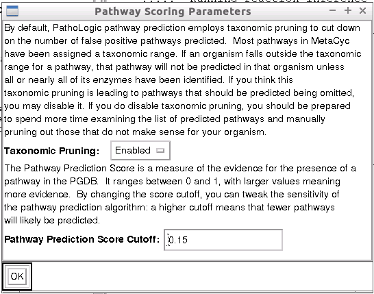

Again the process can take several minutes depending on the number of replicons included. Wait until the process is complete.

Click on <ss>Database</ss> and then <ss>Save DB</ss> from the menu. The pathways have now been predicted, annotated and stored in the database.  

## Verify and test the new Database

Now that the database has been created, we need to verify that it is available for use. First we check that it is present in the Pathway Tools. On the main screen, __Pathway Tools - Available Databases__, you should see a new entry at the bottom of the pre-existing list, __"Streptococcus pyogenes HKU419(ARP)"__.

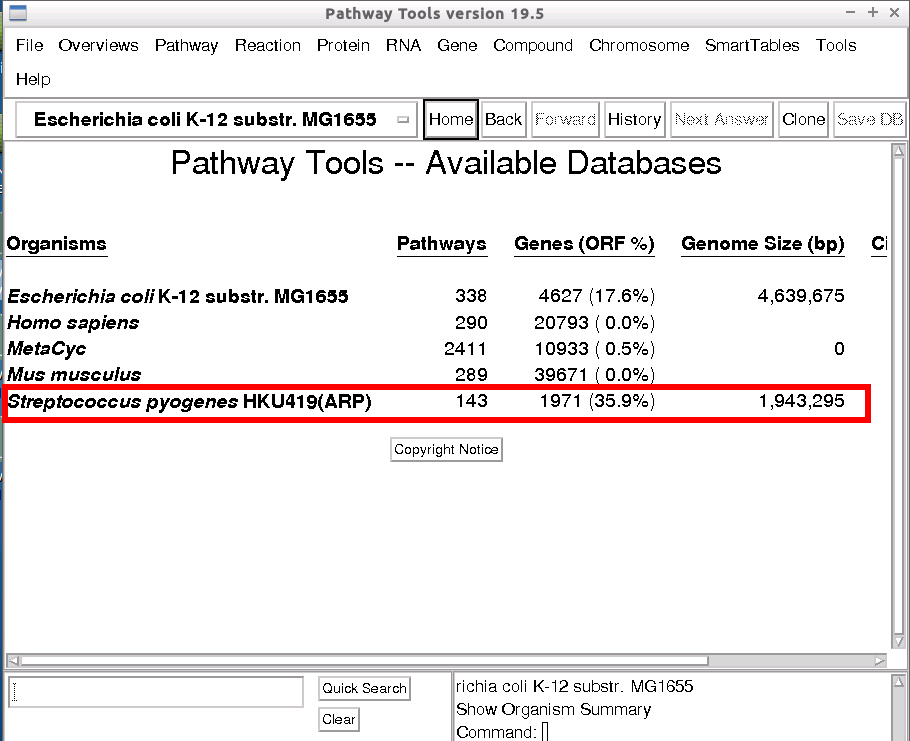

To see this newly created database in the Pathway Tools web-application, start up the Pathway Tools Web service (if not already running).

* You can close all the windows, to exit Pathway Tools
* If the web server is not already running, click on the <ss>Pathway Tool Web server</ss> from the desktop, this is the third icon.
* Open an internet brwoser and go to http://your-mgvl-ip-address:1555

### Using the new database in Pathway Tools Web service

*	On the main screen, click on <ss>change organism database</ss> at the top right corner, under the search box.
*	A new window will appear, select the newly created species from the list
*	Click <ss>OK</ss>

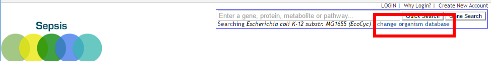
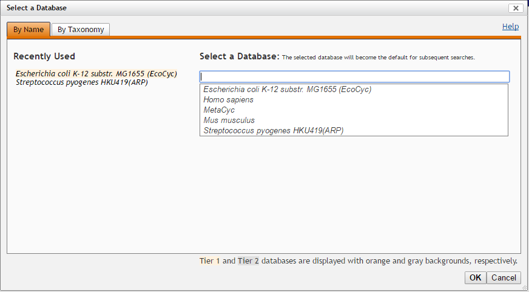

A statistic table of the species will be available for overview.

Click on the <ss>Pathways</ss> link in the table, which will show the list of all predicted pathways in this database.

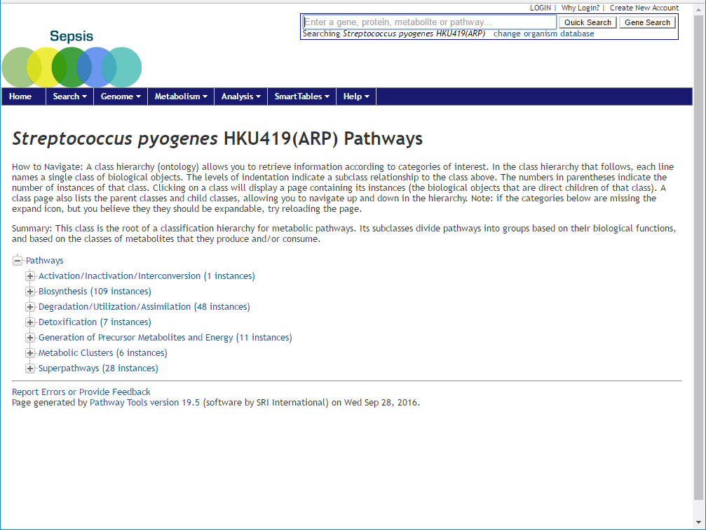

You can navigate through the list of pathways and highlight a pathway of interest. For example,

* Click on the <ss>+</ss> symbol next to __Detoxification__
* Click on the <ss>+</ss> symbol again next to __Antibiotic Resistance__
* Click on <ss>peptidoglycan biosynthesis V (beta-lactam resistance)</ss> which will bring up the pathway view  

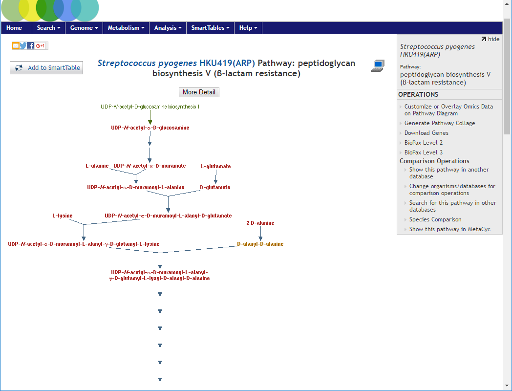

Go back to the previous screen with the statistics summary table and this time click on the <ss>1</ss> under the __Replicon__ heading in the top table. The following genome browser will be shown.

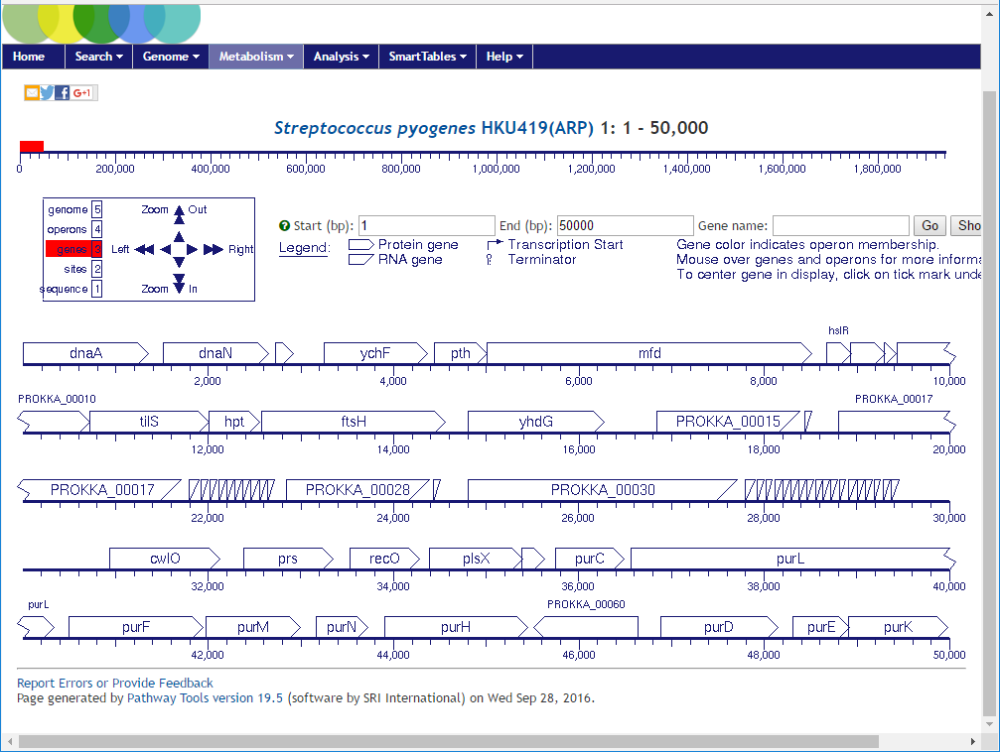

From here forward the user can explore using the Pathway Tools webservice.
