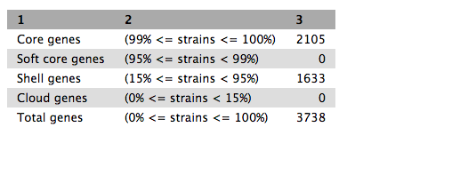
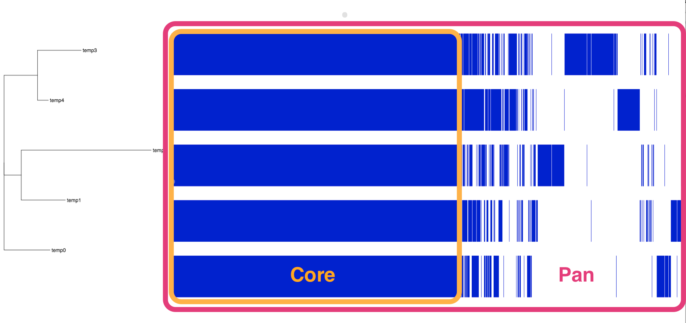

# Find pan-genomes using Roary (in Galaxy)

A concept in comparative microbial genomics is core and pan genomes. If we analyse DNA from several bacterial strains, we may want to know which genes they have in common and which are unique to some strains.

- The *core genome* is the group of genes shared by all strains in the clade of interest. Gene sequences are similar but not necessarily identical. "Core genome SNPs" are those SNPs found in the genes in the core genome; i.e. at a particular site, the nucleotide varies. We can use these SNPs to infer relationships between the strains.

- The *accessory genome* is the group of genes that are not in all the strains. These genes may be in one or more strain.

- The *pan genome* is the sum of the core and accessory genomes. That is, a combination of *all* the genes that are found in the clade of interest.

Bacteria can horizontally-transfer genes to other bacteria via plasmids, and so their accessory genome can be large relative to those of eurkaryotes. Bacterial accessory genomes often house genes for drug resistance.

This tutorial demonstrates how to calculate the pan and core genomes of a set of input bacterial samples, using the tool [Roary](https://sanger-pathogens.github.io/Roary/).

## Get data

Input:

- annotated genome in GFF3 format, per sample (*e.g.* output from Prokka)
- samples must be from same species

Our data:

- Five strains of *Staphylococcus aureus*, in .gff format.
- Galaxy or swift location: ask your demonstrator or load your own data. 

<!-- depends on data release policy-->

## Run

### Run Roary

- In Galaxy, go to <ss>Tools &rarr; NGS Analysis &rarr; Pan Genomes &rarr; Roary</ss>  
- Set the following parameters (leave everything else unchanged):
    - <ss>Individual gff files or a dataset collection</ss>: *Individual*
    - <ss>select gff inputs to Roary</ss>: *Select all the .gff input files*

- Click <ss>Execute</ss>

### What does Roary do

- converts coding sequences into protein sequences
- clustered these protein sequences by several methods
- further refines clusters into orthologous genes
- for each sample, determines if gene is present/absent: produces <fn>gene_presence_absence.csv</fn>
- uses this gene p/a information to build a tree, using FastTree: produces <fn>accessory_binary_genes.fa.newick</fn>
- overall, calculates number of genes that are shared, and unique: produces <fn>summary_statistics.txt</fn>
- aligns the core genes (if option used, as above) for downstream analyses

## Output

There are three output files. 

<!-- (TBA: should be four, if newick tree available) --> 

### Summary statistics

Click on the eye icon. This shows a table of counts of shared genes (core genome) and total genes (pan genome).

 

### Core gene alignment

Click on the disk icon under this file to download it.

### Gene presence/absence

Click on the disk icon under this file to download it. Open and view in spreadsheet software.

  - Column 3 shows the annotated gene name.
  - Column 4 shows the number of isolates that the gene was found it (in this case, ordered from 5 (all) to 1).

<!-- ### Newick TBA- need the accessory_binary_genes.fa.newick (not just .fa) output file -->

## Infer phylogeny using core gene snps

<!-- [Optional step. Or use .nwk tree from gene p/a] -->

Roary has produced an alignment of the core genes. We can use this alignment to infer a phylogenetic tree of the isolates.

- In Galaxy, go to <ss>Tools &rarr; NGS Analysis &rarr; NGS:Phylogenetics &rarr; Phylogeneitc reconstruction with RaXML</ss>  
- Set the following parameters (leave everything else unchanged):
    - <ss>Source file</ss>: <fn>Roary on data x, data x, and others Core Gene Alignment</fn>
    - <ss>Model Type</ss>: *Nucleotide*
    - <ss>Substitution Model</ss>: *GTRGAMMA*

- Click <ss>Execute</ss>

There are six output files.

Click on <ss>Result</ss>. Under the file, click on the "Visualize" icon (a graph), then choose PhyloViz.

<!--[Need to rename these isolates instead of temp0 etc]-->

  - These isolates are all very closely related and so the structure of the tree is narrow.
  - To expand, go to the right hand box for "Phyloviz Settings". Change the Phylogenetic Spacing to 2500 and the Vertical Spacing to 30.

To return to the main Galaxy screen, go to the top panel and click on "Analyze Data".

Click on the disk icon under the <fn>Results</fn> file to download.

Re-name with the file extension <fn>.tree</fn>

## Vizualize with Phandango

If not done already, copy these files to your local computer:

- The <fn>raxml.tree</fn> (or the <fn>accessory_binary_genes.fa.newick</fn>).

- <fn>gene_presence_absence.csv</fn>

Go to <http://phandango.net>

- drag and drop the two files onto the landing page.
- view the tree of samples and their core and pan genomes
- each blue coloured column is a gene: genes are present or absent in each isolate
- the core genes are shared by all isolates

