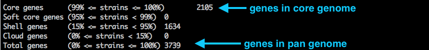
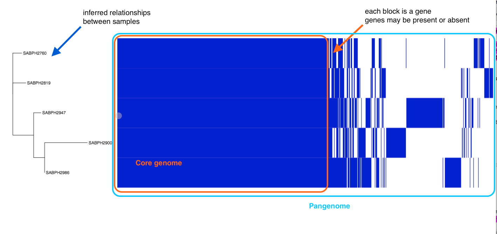

# Find pan-genomes using Roary

A concept in comparative microbial genomics is core and pan genomes. If we analyse DNA from several bacterial strains, we may want to know which genes they have in common and which are unique to some strains.

- The *core genome* is the group of genes shared by all strains in the clade of interest. Gene sequences are similar but not necessarily identical. "Core genome SNPs" are those SNPs found in the genes in the core genome; i.e. at a particular site, the nucleotide varies. We can use these SNPs to infer relationships between the strains.

- The *accessory genome* is the group of genes that are not in all the strains. These genes may be in one or more strain.

- The *pan genome* is the sum of the core and accessory genomes. That is, a combination of *all* the genes that are found in the clade of interest.

Bacteria can horizontally-transfer genes to other bacteria via plasmids, and so their accessory genome can be large relative to those of eurkaryotes. Bacterial accessory genomes often house genes for drug resistance.

This tutorial demonstrates how to calculate the pan and core genomes of a set of input bacterial samples, using the tool [Roary](https://sanger-pathogens.github.io/Roary/).


## Get data

Input:

- annotated genome in GFF3 format, per sample (*e.g.* output from Prokka)
- samples must be from same species

Our data:
<!-- location: mdu server/roary_tutorial: the 5 staph aureus samples from the sepsis-done folder. i.e. these genomes and annotations might have since been updated -->

<!-- note: BPA data upload split genomes into chromosome and plasmids. The ones here are combined and not necessarily identical to those in the BPA set -->

- Five strains of *Staphylococcus aureus*, in .gff format.
<!-- note: I don't know if these all have unique locus tags for the gene IDs. Could re-run in prokka with this locus tag, e.g.:
prokka --kingdom Bacteria --outdir prokka_GCA_000008285 --genus Listeria --locustag GCA_000008285 GCA_000008285.1_ASM828v1_genomic.fna
-->


## Run

### Run roary

```text
roary -e --mafft -p 8 *.gff
```

- `-e --mafft` aligns the core genes using the tool MAFFT
- `-p 8` uses 8 threads


### What does Roary do

- converts coding sequences into protein sequences
- clustered these protein sequences by several methods
- further refines clusters into orthologous genes
- for each sample, determines if gene is present/absent: produces <fn>gene_presence_absence.csv</fn>
- uses this gene p/a information to build a tree, using FastTree: produces <fn>accessory_binary_genes.fa.newick</fn>
- overall, calculates number of genes that are shared, and unique: produces <fn>summary_statistics.txt</fn>
- aligns the core genes (if option used, as above) for downstream analyses


## Output

### Core and pan genes

Open the summary file:

`less summary_statistics.txt`

This shows a table of counts of shared genes (core genome) and total genes (pan genome).




What are the core genes?

`query_pan_genome -a intersection -o core_genome_results *.gff`

What are the accessory genes?

`query_pan_genome -a complement -o accessory_genome_results *.gff`

What are the pan genes?

`query_pan_genome -a union -o pan_genome_results *.gff`


View: *e.g.*

`less core_genome_results | column -t`


### Gene presence/absence

Transfer the file <fn>gene_presence_absence.csv</fn> to your local computer and view in spreadsheet software.

- Search for the gene that confers methicillin resistance. It is only found in some of the strains.

<!-- ### Optional: Build a tree of core genome SNPs
- core genes only: the snps can be used to build a tree
FastTree? -->


## Vizualize with Phandango

Copy these files to your local computer:

- <fn>accessory_binary_genes.fa.newick</fn>
- <fn>gene_presence_absence.csv</fn>

Go to <http://phandango.net>

- drag and drop the two files onto the landing page.
- view the tree of samples and their core and pan genomes




## Links

- Roary: <https://sanger-pathogens.github.io/Roary/>
- Roary publication: <http://bioinformatics.oxfordjournals.org/content/31/22/3691>
