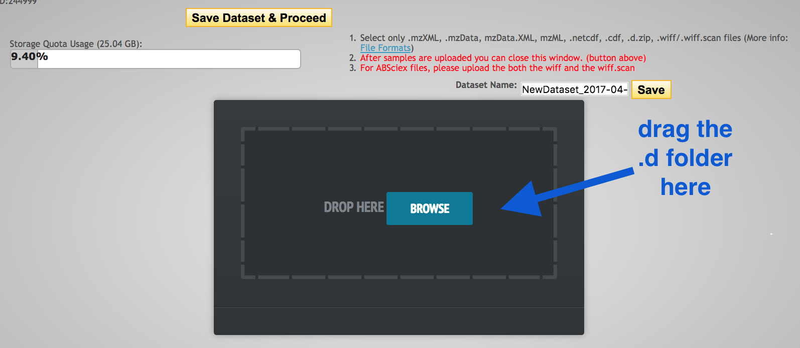

 
# Metabolomics with XCMS

## Overview

Metabolomics is the study of metabolites: small molecules (smaller than proteins) produced by organisms. One technique to identify and quantify metabolites is mass spectrometry. Metabolites are ionized, which breaks them into charged fragments. Next, the abundance of each fragment is measured. A graph shows abundance peaks at various mass-to-charge ratios. This spectrum of peaks (the mass spectrum) is matched to a database of known spectra, to identify the metabolite from which it was produced.

LC separates the metabolites and then these are sent to MS.

Molecular ions can have +1 or more charged, but we mainly look at the M+1

This ion (what value - its mass?) is entered into Metlin.

"each peak is associated with a mass-to-charge ratio, retention time,
fold change, p-value, and relative intensity "

identify features (ions with unique m/z and retention time)
and then filter eg based on:
- those that differ bn treatment and control with eg certain fold change (eg >3) and certain p value (eg < 0.0001)
- then put these in a cloud plot. cloud plots:
useful bc they display info about the biochemistry of the molecules. eg they show the m/z value and retention time (eg this differs for fat-soluble and water-soluble molecules).

Compare metabolites in two groups (e.g. 2 different bacterial strains).

## XCMS

In this tutorial, we will use XCMS online.

- Go to: <https://xcmsonline.scripps.edu> and sign up.

More about XCMS online
- inputs: raw data from mass spec
- output: data converted to identified metabolites (via METLIN db?)

## Get data

The data we will use today is from two bacterial strains of *Klebsiella pneumoniae* - strain AJ218 and strain KPC2.

Download these to your local computer from swift [add to swift and add link here - if data policy allows].

Sample 1
- 25817_SEP_MA_LC-MS_AJ218-1-813-28038_Bio21-LC-QTOF-001.d

Sample 2
- 25823_SEP_MA_LC-MS_KPC2-1-813-28033_Bio21-LC-QTOF-001.d

Note: if using sepsis data: download the .tar.gz files, uncompress (by clicking on them). We do not need to unzip them.

You should now have two .d folders on your computer.

## Upload data

In the top panel, go to <ss>Stored Datasets</ss>. We will upload some data here.

In the top right corner, click on <ss>Add Dataset(s)</ss>.

- Drag the <fn>.d folder</fn> into the <ss>Drop Here</ss> box.
- (Don't select Browse.)

- Wait until all files have a green tick (scroll down to check all).
- Name the datset (e.g. Sample AJ218 or Sample KPC2) and click <ss>Save</ss>.
- Click <ss>Save Dataset & Proceed</ss>.

Repeat with the second <fn>.d folder</fn>

## Set up job

In the top panel, click on <ss>Create Job</ss> and select <ss>Pairwise Job</ss>.

On the right hand side, under Job Summary, Job Name: enter job name.

Under <ss>Dataset 1</ss> click on <ss>Select Dataset</ss>.

- Choose Sample AJ218.

Under <ss>Dataset 2</ss> click on <ss>Select Dataset</ss>.

- Choose Sample KPC2.

We now need to set parameters that correspond with the machine on which the data was generated.

Under <ss>Parameters</ss> select HPLC / Q-TOF.

Click <ss>Create New</ss> in the bottom right hand corner.

Give it a name. e.g. Agilent 6545

See the tabs along the top: we will change some of these settings.

Need to change polarity to negative?
Need to change format to seconds?

**Feature Detection**

There are two sets of data we will customise here: centroid data and profile data.

Next to Method, click centWave (the centroid data).
- change these and also select view advanced options?

Next to Method, click matchedFilter (the profile data)
- change these and also select view advanced options?

**Retention Time Correction**

This is to correct shift as run progresses? (ie still within one run?)

We will change settings for obiwarp and peakgroups.

**Alignment**

Does this correct between runs?

**Statistics**

Choose Wilcoxon signed rank test?

**Annotation**

which settings

**Identification**

which settings
also: biosource - choose a K pneumo?

**Visualization**
which settings

**Miscellaneous**

which settings

<ss>Save Current</ss>

<ss>Submit Job</ss>

Will now bring up the View Results page.

- The current job will be listed as "Processing" with a % completion bar.

## View results

Click on <ss>View</ss>.

Stats:
- are 2 samples different? (is that right)

Identification:
- is this converting pattern to metabolite?

The [METLIN database](https://metlin.scripps.edu/landing_page.php?pgcontent=mainPage) contains data on metabolites, their mass, their known and predicted fragment masses.

Viz:
- what is EIC width

- The main result is a matrix of metabolite values. (amts?)

Things to know: -- correct?

Retention time: the gaseous, charged fragment will be retained in the detector chamber for longer if it is heavier. Thus, retention time is a proxy for the fragment's mass.  
Peak: In a graph of mass vs ?, the peak is a detection of a fragment. Compare height of peaks between 2 groups. Just of the metabolite, prior to fragmentation?

mass and the fragmentation data (MS/MS spectra) for each metabolite peak. ??

GRAPHS
Pairwise Jobs will have an initial results screen that provides a summary with the following graphs:

Total Ion Chromatograms (TIC) Before retention time alignment

Retention Time Deviation vs Retention Time

Total Ion Chromatograms (TIC) post retention time correction

Cloud plot: m/z vs retention time
What are the circles - abundance of metabolites?
Can adjust:
m/z
retention time
intensity
-- why can u adjust? is it for zooming in?  

Multidimensional Scaling (MDS)

Principal Component Analysis (PCA)
- can re-scale? why?

Optionally a MS/MS scan location plot if MS/MS data was included in file upload

TABLE
The View Results Table is different than the View Results page and can be found by clicking the “VIEW” button of a job. On the left side is a button named "View Results Table."

## Next

More complex analyses: eg compare wildtype with 5 mutants. Metabolites in common to the 5 mutants identified; then investigate biochemical pathway and function.

## Links

[XCMS Online](https://xcmsonline.scripps.edu)

["XCMS Online" documentation](https://xcmsonline.scripps.edu/landing_page.php?pgcontent=documentation)
