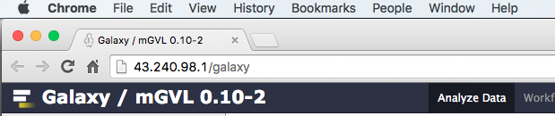

# Introduction to Galaxy

## Background

Galaxy is a web based analysis and workflow platform designed for
biologists to analyse their own data. It can be used to run a variety
bioinformatics tools. The selection of bioinformatics tools installed on
the Galaxy instance we are using today caters for the analysis of
bacterial genomics data sets.

Bioinformatics tools can added from the Galaxy ‘tool shed’ (App Store)
or removed as necessary from your Galaxy instance.

Galaxy is an open, web-based platform, details about the project can be
found [here](https://galaxyproject.org/) (International Open Source
Project).

The Galaxy interface is separated into 3 parts. The **tool** list on the
left, the **viewing** panel in the middle and the analysis and data
**history** on the right. We will be looking at all 3 parts in this
tutorial.

This activity will familiarise you with the Galaxy interface. It will
cover the following operations:

-   Logging in to the server
-   Putting data onto Galaxy
-   Using to use some common tools

## Learning Objectives

At the end of this tutorial you should:

1.  Be able to register on and login to a Galaxy server.

2.  Be able to upload data to a Galaxy server from:

    -   A file on your local computer
    -   A file on a remote datastore with an accessible URL.

3.  Be able use tools in Galaxy by:

    -   Accessing the tool via the tool menu
    -   Using the tool interface to run the particular tool
    -   Viewing/accessing the tool output.

## Section 1: Logon to Galaxy

1.  Open a new tab or window on your web browser

    -   Use Firefox or Chrome - Please don’t use Internet Explorer
        or Safari.
    -   Type in the following address: 43.240.98.1/galaxy

1.  Register/Login as a user

**Login:**

1.  -   On the top menu select: **User -&gt; Login**
    -   Enter your username & password
    -   Click **Submit**

**Register:**

1.  -   On the top menu select: **User -&gt; Register**
    -   Enter your email, choose a password, repeat it and add a (all
        lower case) one word name
    -   Click **Submit**

## Section 2: Putting data onto Galaxy

There are 2 main ways to put your data onto Galaxy, this section will
run through both ways.

Before you start on this section please make a New History.

**New History**

Note: Make a new folder to store the work we are about to perform

-   -   Click on the history menu button (the  icon) at the top of the History panel.
    -   Select **Create New**

**Datatypes**

What sort of file is being uploaded?

We need to tell Galaxy what sort of file is being uploaded. Some common
datatypes (file formats) are: text, fasta, fastq, vcf, GFF, GenBank,
tabular.

## Method 1: Upload a file from your own computer

With this method you can get most of the files on your own computer into
Galaxy.

-   Download the following file to your computer:

**Download file**

Copy the URL below and paste the address into your web browser

[https://swift.rc.nectar.org.au:8888/v1/AUTH\_377/public/galaxy101/Contig\_stats.txt.gz](https://www.google.com/url?q=https://swift.rc.nectar.org.au:8888/v1/AUTH_377/public/galaxy101/Contig_stats.txt.gz&sa=D&ust=1464144450746000&usg=AFQjCNHvu1ZJj4bIus5JP4VpuTLcdXWxKw)

Note the download location

**Uploading the File to Galaxy**

-   -   From the Galaxy tool panel, click on **Get Data -> Upload
        File**
    -   Click the **Choose File** button
    -   Find and select the *Contig_stats.txt.gz* file you downloaded
        and click **Open**
    -   Set the "file format" to *tabular*
    -   Click the **Start** button
    -   Once the progress bar reaches 100%, click the **Close** button

The file will now upload to your current history.

## Method 2: Upload a file from a URL

If a file exists on a web resource somewhere and you know its URL
(Unique Resource Location - a web address) you can directly load it into
Galaxy.

-   From the tool panel, click on **Get Data -> Upload File**

    -   Click on the **Paste/Fetch Data** button
    -   Copy and paste the following web address into the URL/Text box:

(https://swift.rc.nectar.org.au:8888/v1/AUTH_377/public/COMP90014/Assignment1/bacterial_std_err_1.fastq.gz)

-   Set the file format to *fastqsanger* (CAREFUL: not fastq**c**sanger)
    -   Click **Start**
    -   Once the progress bar has reached 100%, click **Close**

Note that Galaxy is smart enough to recognize that this is a compressed
file and so it will uncompress it as it loads it.

## Method 2: (Another file!) Get data from a public URL

Now we are going to upload another file from the remote data source.

Repeat the above for:
(https://swift.rc.nectar.org.au:8888/v1/AUTH_377/public/MRSA0252.fna)

Note: this file is a *fasta* file.

The DNA sequence of *Staphylococcus aureus MRSA252* will be loaded into
your history as a fasta file.

Your **History** should now look like this:

## The data

A brief description of each of the 3 files uploaded to Galaxy

-   *Contigs_stats.txt*

    -   this file contains a table of summary data from a *de novo*
        genome assembly (the process of attempting to recover the full
        genome of an organism from the short read sequences produced by
        most DNA sequencing machines. )
    -   The columns contain a lot of information but the ones we will be
        using indicate the amount of data (or coverage) that went into
        making up each piece of the final assembly.

-   *bacterial_std_err_1.fastq.gz*

    -   This file contains sequence reads, in the format produced by
        Illumina sequencing machines. Read more about the
        [fastq](https://en.wikipedia.org/wiki/FASTQ_format) format
        at Wikipedia.

-   *MRSA0252.fna*

    -   This file contains the genome sequence of *Staphylococcus aureus
        MRSA252*. Read more about the
        [fasta](https://en.wikipedia.org/wiki/FASTA_format) format
        at Wikipedia.

## Section 3: Play with the tools

The purpose of this section is to help you become familiar with the way
tools are run on Galaxy.

Two of the files in the **History** have very long and confusing names.
File names can be changed by taking the following steps:

**Rename Files**

1.  Click on the edit icon  next to the file in the **History** called:

https://swift.rc.nectar.org.au:8888/v1/AUTH_377/public/COMP90014/Assignment1/bacterial_std_err_1.fastq

1.  In the "Name" text box, give it a new name. Rename it to:
    “*typical.fastq”*
2.  Click the **Save** button.

Repeat the process with the file called:

https://swift.rc.nectar.org.au:8888/v1/AUTH_377/public/MRSA0252.fna

Rename it to *MRSA252.fna*

Much better. There is other functionality hidden behind that edit icon 

You can change a file’s datatype, convert its format and many
other things. Feel free to play around with them at a later date.

## Example 1: Histogram and summary statistics

We are going to produce a histogram of contig read coverage depths and
calculate the summary statistics from the *Contig_stats.txt* file.

To do this we need to make some changes to the *Contig_stats.txt* file.

-   cut out a couple of columns from the file
-   remove a line from the file
-   then produce a histogram.

This example will demonstrate some of the text manipulation tools.

Click on the eye icon  of the *Contig_stats.txt* file to have a look at it.
Note that there are 18 columns in this file. We want column 1 and column 6.

To do this:

**1. Cut out and keep column 1 and column 6.**

-   From the **tool** panel, click on **Text Manipulation -> Cut**
    and set the following:
-   Set "Cut Columns" to: *c1,c6*
-   "Delimited by": *Tab*
-   "Cut from": *Contig\_stats.txt*
-   Click **Execute**

Examine the new file by clicking on it’s eye icon . We now have 2 columns instead of the 18 in the original file.

**2. Remove the Header lines of the new file.**

-   From the **tool** panel, click on **Text Manipulation -> Remove
    beginning** and set the following:
-   "Remove First": *1*
-   "from": *Cut on data1*
-   click **Execute**

Note the the new file is the same as the previous one without the header
line.

**3. Make a histogram.**

-   From the **tool** panel, click on **Graph/Display Data -> Histogram** and set the following:
-   "Dataset": *Remove beginning on Data X*
-   "Numerical column for X axis": *c2*
-   "Number of breaks": *25*
-   "Plot title": *Histogram of Contig Coverage*
-   "Label for X axis": *Coverage depth*
-   Click **Execute**

Click on the eye icon  of the histogram to have a look at it. Note there are a few peaks. Maybe these correspond to single, double and triple copy number of these contigs.

**4. Calculate summary statistics for contig coverage depth.**

-   From the tool panel, click on **Statistics -&gt; Summary
    Statisitics** and set the following:
-   "Summary statistics on": *Remove beginning on Data X*
-   "Column or expression": *c2*
-   Click **Execute**

You’ll note that the summary statistics tool failed (red background in
the **History**). There was an error! If you click on the filename, and
then the bug symbol , it will tell you what went wrong. (There is a
missing python library). At this point, you would normally contact your
Galaxy server administrator.

## Example 2: Convert Fastq to Fasta

This shows how to convert a fastq file to a fasta file. The tool creates
a new file with the converted data.

**Converter tool**

-   From the **tool** panel, click on **Convert Formats -> FASTQ to
    FASTA** and set the following:
-   "FASTQ file to convert": *typical.fastq*
-   Click **Execute**

The output is a new Fasta file called *FASTQ to FASTA on data 2*.

## Example 3: Find Ribosomal RNA Features in a DNA Sequence

This example shows how to use a tool called “barrnap” to search for
rRNAs in a DNA sequence.

**1. Find all of the ribosomal RNA's in a sequence**

-   From the tool panel, click on **Annotation -&gt; barrnap** and set
    the following:
-   "Fasta file": MRSA252.fna
-   Click **Execute**

The output is *barrnap on data 3*. It is a format gff3 file. (general
feature format version 3). Each line in the file describes a feature in
the DNA sequence.

Make a file with only the 23S rRNA features

Use a Filter tool

**2. Filter the annotations to get the 23S RNAs**

-   From the tool panel, click on **Filter and Sort -> Select** and
    set the following:
-   "Select lines from": (whatever you called the barrnap gff3 output)
-   "the pattern": *23S* (this will look for all the lines in the file
    that contain “23S”)
-   Click **Execute**

Now you have a gff3 file with just the 23S annotations!

## What now?

Remember how we started a new **History** at the beginning? If you want
to see any of your old histories, click on the **History** menu button  at the top of the **History** panel and then select “Saved Histories.”
This will give you a list of all the histories you have worked on in
this Galaxy server.
