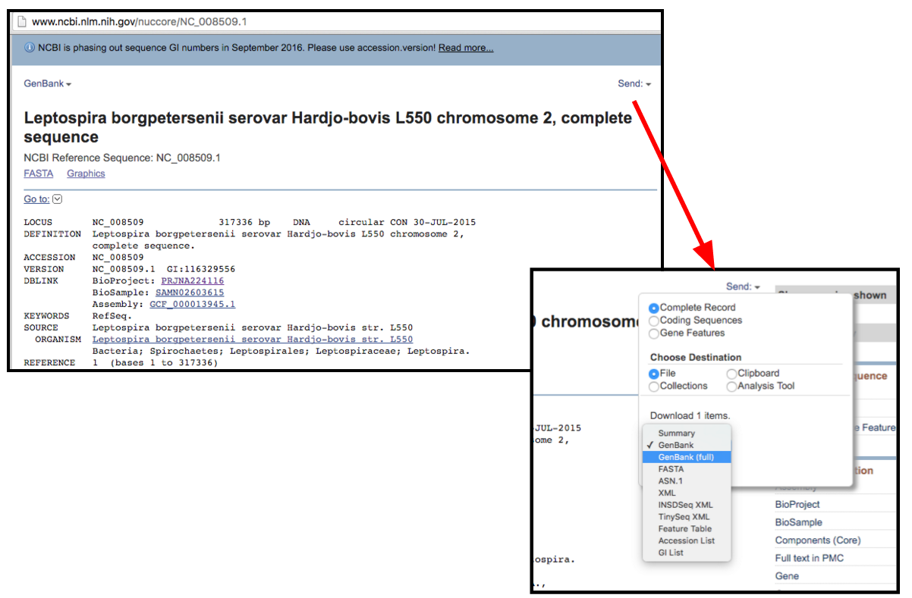
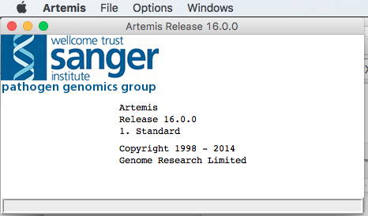

Getting Started with Artemis {#h.9cr0qpqpazk2 .c10 .c4}
========================================================

Background {#h.dp5rzvehn2x1 .c4 .c10}
----------------------------------

Artemis is a genome browser and annotation tool.
Artemis is written in java and can be used on Mac, Linux or Windows.
While it can be used to view any genomic data, it is specifically
designed for viewing bacterial or viral genomes. A variety of file types
can be loaded and viewed using Artemis, these include fasta, multifasta,
EMBL, GenBank and GFF format files.  

Objectives 

1.  Be able to install Artemis on your laptop
2.  Be able to download a bacterial genome sequence
3.  Be able open the genome sequence in Artemis and navigate
    the sequence.

Section 1: Installing Artemis {#h.djl8ciezoakg .c10 .c4}
-----------------------------------------------------

Artemis is available at no cost from the Sanger
Institute Website. Instructions for downloading and installing Artemis
can be found at:

[http://www.sanger.ac.uk/science/tools/artemis](https://www.google.com/url?q=http://www.sanger.ac.uk/science/tools/artemis&sa=D&ust=1464150347992000&usg=AFQjCNFYe4VM-YIGfoxv3KJtS9Bxq00IYQ){.c14}

Download and run

Not working? The most common problem: Java is either
not installed or too old.

Artemis needs a recent version of Java v1.6 or higher.
Go to java.com and update

Still not working? Seek help!

Section 2: Downloading a bacterial genome {#h.pjbgv66oq4w7 .c10 .c4}
-----------------------------------------------------------------

Download the sequence of Leptospira
borgpetersenii serovar Hardjobovis Chromosome II from the
NCBI website in GenBank format 

Open URL: [http://www.ncbi.nlm.nih.gov/](https://www.google.com/url?q=http://www.ncbi.nlm.nih.gov/&sa=D&ust=1464150347994000&usg=AFQjCNGIYvduLk7Ebo1wQwNwH7ySOqfB4Q){.c14}

Select the “Taxonomy” database

Enter “Leptospira borgpetersenii” in the search box and
Search

Click to follow these links:

Then

Then

Then

Then

------------------------------------------------------------------------

To:

Downloading the file is performed from the “Send” pulldown

Section 3: Opening the GenBank file in Artemis {#h.4pfaquyx3f2q .c10 .c4}
----------------------------------------------------------------------

Menu: File → Open

Select file from dialog box → OPEN

Demonstration/Discussion of the Artemis
interface
