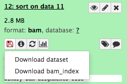

# Comparative Genomics

## Background

In this activity we will use the BWA short read mapper and Freebayes
variant caller to identify ‘micro’ differences between genome
sequences.

The genome sequences being compared are those of the ‘wildtype’ and
‘mutant’ strains.

The relevant files should already be available on Galaxy.

Just for a recap:

We have a closed, annotated genome sequence for the wildtype strain.

- Files: wildtype.fna and wildtype.gff

For the mutant strain we have whole genome shotgun short sequence reads
from an Illumina DNA sequencing instrument

- Files: mutant_R1.fastq and mutant_R2.fastq (fastq format)

-   The reads are paired-end
-   Each read is 150 bases  
-   The reads coverage depth is estimated at 19x.

After investigating the ‘micro’ differences (SNPs / INDELS), we will
attempt to detect larger ‘macro’ differences using Mauve.

## Map Reads to Reference

1. **Map the reads on to the reference sequence**

Several programs could be used for this but we will use BWA-MEM.

- Open the BWA-MEM tool interface (from the tool panel **NGS: Mapping -> Map with BWA-MEM**.

- Set the following parameters:

**Will you select a reference genome from your history or use a built-in index?: Use a genome from history and build index*

**Use the following dataset as the reference sequence: wildtype.fna**

**Select first set of reads:** mutant_R1.fastq

**Select second set of reads:** mutant_R2.fastq

Click **Execute**

## Examine the mapped reads

**Look at the contents of the BAM file**

NOTE: The BAM file is a Binary Compressed Datafile and cannot be viewed directly. If you attempt to view it using the view data button it will be downloaded to your local computer. Instead we must convert it to a non-compressed text format (SAM) first.

- First we have to convert the BAM file to a SAM file.
- Open the BAM-to-SAM tool interface: (on the tool panel **NGS: SAM tools -> BAM-to-SAM**.
- View the resultant SAM file by clicking on the View Data button.
- Have a look at the fields in the file.
- The demonstrator will now point out what all the fields are.

## Viewing the BAM file using Artemis

In this section we will view the BAM file produced we produced above in
Artemis.

**Download the BAM file to your local computer**  
- Click on the name of the BAM file that you created in Section 1.  
- Click on the download button , you need to download both the BAM file and the bam_index.

**Start Artemis and load the wildtype.gff**  
- From the Artemis menu, Click **File -> Open ...**  
- Load *wildtype.gff*

You should now have the wildtype’s annotated sequence loaded into the Artemis genome browser.

**Load the BAM file into Artemis**   
- Click **File -> Read BAM / VCF**  
- Select: *Galaxy … .bam*  
- Click **Ok**   

You should see something like this:

Can you find a SNP?

Demonstration of the ways that the view of the BAM file can be enhanced!

Imagine finding each SNP manually - Luckily this can be automated using a tool available on Galaxy.

## Variant Calling

We will now search through our alignment file (BAM) for statistically
valid SNPs using the Freebayes variant calling tool.

**Run Freebayes**

- Load the Freebayes tool interface (on the tool panel: **NGS: Variant Detection -> Freebayes**.
- Set the following parameters:

**Load reference genome from:** *History*  
**Sample BAM file: Map with BWA-MEM on data … BAM format)**  
**Use the following dataset as the reference sequence: wildtype.fna**  

Click **Execute**

**Examine the Freebayes output**

- Freebayes will create a VCF file. This stands for Variant Calling Format.
- Click on its View Data button and have a look at the file. There is a lot of header information, the variants appear lower down.
- Can you spot a SNP?
- What about an insertion? A deletion?

## Investigation of Variants

What is the impact of the differences we have observed?

In this section we will use some simple investigation strategies to
predict the impact of the difference on the function of the gene and
perhaps even the strain itself.

**Artemis** - the annotated draft genome sequence of the mutant strain -
what is the impact the protein coding region? what is the predicted
function?

**blastp** - <http://blast.ncbi.nlm.nih.gov/Blast.cgi> the protein domain display - are any major protein domains truncated by the difference?

**LipoP/SignalP/TmHMM** <http://www.cbs.dtu.dk/services/> membrane location prediction - has the change had an impact on the membrane location of the protein?

**Literature?**

Can you suggest a type of nucleotide sequence that might have no impact on the function of the encoded protein?

In this section we will investigate a few variants together as a demonstration

perhaps a few individually too??

## Detection of ‘macro’ INDELS and rearrangement using Mauve

We will now examine our earlier assembly and compare it with the reference on a genome wide basis using Mauve.

Download and install Mauve. More information on Mauve and its use can be found [here](http://darlinglab.org/mauve/mauve.html).

You will then need to load both the reference *wildtype.gff* file and the *mutant.gff* file that you downloaded earlier.

